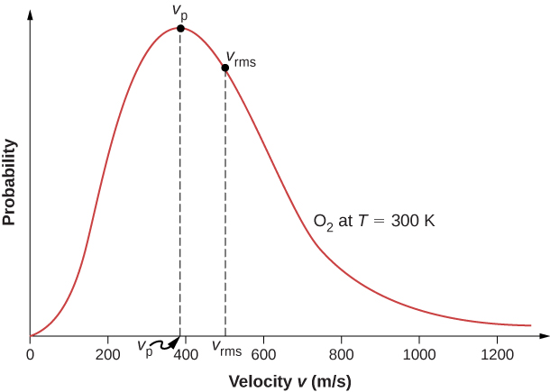

# Cinétique des gaz parfaits

## Modèle du gaz parfait monoatomique

Les modèles de gaz parfaits sont des modèles idéalisés qui permettent de décrire le comportement des gaz dans des conditions spécifiques. Dans des conditions réelles de température et de pression modérées, les gaz réels ne se comportent pas exactement comme des gaz parfaits. On verra à la fin du cours un modèle plus réaliste, le **modèle de Van der Waals**.

Les hypothèses du modèle de gaz parfait monoatomique sont les suivantes :

- Les molécules du gaz sont considérées comme des particules ponctuelles sans volume propre.
- Il n'y a pas d'interactions entre les molécules. Si deux particules se rencontrent n'échangent pas d'énergie, elles rebondissent de manière élastique.
- Ces particules sont animées d'un mouvement incessant et aléatoire, appelé [mouvement brownien](https://fr.wikipedia.org/wiki/Mouvement_brownien), qui constitue l'[agitation thermique](https://fr.wikipedia.org/wiki/%C3%89nergie_thermique).
- Les chocs entre les molécules et les parois du récipient sont parfaitement élastiques.
- Le mouvement des particules est rectiligne et uniforme entre deux collisions.

Les particules sont donc en mouvement constant, mais leur vecteur moyen de vitesse est nul, sinon le gaz se déplacerait dans une direction privilégiée.

## Mélange de gaz parfaits

Pour un mélange de gaz parfait, on peut considérer chaque gaz comme un gaz parfait individuel. Le mélange en soit est aussi un gaz parfait. Chaque gaz exerce une pression partielle, et la pression totale du mélange est la somme des pressions partielles de chaque gaz, conformément à la loi de Dalton :

$$ P_{total} = \sum_{i} P_{i} $$

$$\text{Loi de Dalton}$$

La pression partielle d'un gaz dans un mélange est la pression qu'exercerait ce gaz s'il occupait seul **le volume total du mélange** (parce que les particules sont considérées sans volume propre) à la même température.

$$ P_{i} = \frac{n_{i}RT}{V} $$

La fraction molaire d'un gaz dans un mélange est définie comme le rapport du nombre de moles de ce gaz au nombre total de moles dans le mélange :

$$ x_{i} = \frac{n_{i}}{n_{total}} $$

La pression partielle peut aussi être exprimée en fonction de la fraction molaire :

$$ P_{i} = x_{i} P_{total} $$

La masse molaire $M$ du mélange peut être calculée en utilisant les fractions molaires et les masses molaires des composants individuels :

$$ M_{mélange} = \sum_{i} x_{i} M_{i} $$

## Modèle cinétique du gaz parfait monoatomique

### Distribution des vitesses des particules

Nous allons considérer un gaz parfait monoatomique contenu dans un volume $V$, à une température $T$ et une pression $P$ (grandeurs d'état).

Nous allons définir la densité particulaire $n^*$ comme le nombre de particules par unité de volume, qui est $\boxed{n^* = \frac{N}{V}}$, où $N=n\cdot N_A$ est le nombre total de particules dans le volume $V$ (avec $n$ le nombre de moles et $N_A$ le nombre d'Avogadro).

$n^*$ est uniforme, c'est-à-dire que la densité de particules est la même en tout point du volume $V$. Il s'agit d'une situation d'équilibre macroscopique. Si $n^*$ n'était pas uniforme, il y aurait des flux/diffusions de particules d'une région à forte densité vers une région à faible densité, et le système ne serait pas à l'équilibre.

Nous souhaitons maintenant relier les grandeurs microscopiques (vitesse des particules) aux grandeurs macroscopiques (pression, température).

Les vitesses des particules sont distribuées selon une loi de probabilité, appelée [loi de distribution de Maxwell-Boltzmann](https://fr.wikipedia.org/wiki/Loi_de_distribution_des_vitesses_de_Maxwell). Cette loi décrit la répartition des vitesses des particules dans un gaz parfait à l'équilibre thermique.

La loi de distribution est la même pour les trois coordonnées cartésiennes $v_x$, $v_y$ et $v_z$. La vitesse d'une particule est donc un vecteur $\vec{v} = (v_x, v_y, v_z)$.

Le vecteur vitesse est en moyenne nul, car les particules se déplacent dans toutes les directions de manière aléatoire.

$$\langle \vec{v} \rangle = \vec{0} $$

On cherche à exprimer la probabilité $P$ d'avoir une valeur de vitesse $v_x$ dans l'intervalle $[v_x, v_x + dv_x]$ (La démarche est la même et redondante pour $v_y$ et $v_z$, comme mentionné juste en haut).

$$ dP = \varphi(\vec v)dv_x dv_y dv_z $$

Avec $\varphi(\vec v)$ la fonction de distribution des vitesses. Comme la distribution est la même dans les trois directions, $\varphi$ ne dépend que de la norme de la vitesse $||\vec v|| = \sqrt{v_x^2 + v_y^2 + v_z^2}$.

$$\varphi(\vec v) = \varphi(||\vec v||)$$

*On doit utiliser les différentielles pour pouvoir utiliser les outils d'intégration et dérivation usuels.*

La norme de la vitesse est reliée à l'énergie cinétique $E_c$ de la particule par la relation :

$$ E_c = \frac{1}{2} m ||\vec v||^2 $$

Donc la distribution des vitesses peut aussi s'écrire en fonction de l'énergie cinétique.

Le facteur de Boltzmann $e^{-\frac{E_c}{k_B T}}$ (vue dans le cours précédent) permet de relier l'énergie à la température.

On a donc $\varphi(v) = A e^{-\frac{1}{2} \frac{m v^2}{k_B T}}$, avec $A$ une constante de normalisation.

>[!NOTE]Justification mathématique (hors programme)
> La forme exponentielle de la fonction de distribution des vitesse vient de l'hypothèse d'indépendance des distributions selon x,y,z et de l'isotropie de l'espace.
> 
> En effet, la seule solution mathématique satisfaisant l'équation fonctionnelle $f(v_x​)\cdot f(v_y​)f(v_z​)=g(v^2)$ est de la forme $e^{-\alpha v^2}$.
> 
> En ce qui concerne la constante de normalisation $A$, celle-ci est introduite pour assurer la conservation de la probabilité totale. Elle est déterminée par la condition de fermeture :
$\int_{\mathbb{R}^3} \varphi(\vec{v}) d^3v = 1$
>
> Prenez cette justification avec de très grosses pincettes. Lisez [cet article Wikipédia](https://fr.wikipedia.org/wiki/Loi_de_distribution_des_vitesses_de_Maxwell#Obtention_de_la_distribution_par_la_physique_statistique) pour "plus" de détails.

A compense l'intégrale de la gaussienne pour ramener la probabilité totale à 1.

On souhaite maintenant intégrer cette fonction $P$ de probabilité pour obtenir la probabilité d'avoir une vitesse dans un intervalle donné.

On va changer les différentiels $dv_x dv_y dv_z$ en coordonnées sphériques, où $v$ est la norme de la vitesse, $\theta$ l'angle polaire et $\phi$ l'angle azimutal.

On fait une analogie avec le volume élémentaire en coordonnées sphériques :

$$ dv_x dv_y dv_z = v^2 \sin(\theta) dv d\theta d\phi $$

$$r^2 = x^2 + y^2 + z^2$$

avec $r \in [0, +\infty[$

L'intégrale $\int dP$ est égale à 1 (car la somme des probabilités doit être égale à 1).

On réecrit alors $dP$ en coordonnées sphériques :

$$ dP = A e^{-\frac{1}{2} \frac{m v^2}{k_B T}} v^2 \sin(\theta) dv d\theta d\phi $$

Après intégration, on trouve : $1=A\int_0^{+\infty} e^{-\frac{1}{2} \frac{m v^2}{k_B T}} v^2 dv \int_0^{\pi} \sin(\theta) d\theta \int_0^{2\pi} d\phi$.

(On peut séparer les termes d'intégration car ils sont indépendants.)

On trouve alors :

$$4\pi A \int_0^{+\infty} e^{-\frac{1}{2} \frac{m v^2}{k_B T}} v^2 dv = 1 $$

On effectue une intégration par parties pour enfin trouver la fonction de distribution des vitesses :

$$ \varphi(v) = 4\pi \left( \frac{m}{2\pi k_B T} \right)^{3/2} v^2 e^{-\frac{1}{2} \frac{m v^2}{k_B T}} $$

$$A = \left( \frac{m}{2\pi k_B T} \right)^{3/2} $$

Comme les intégrales généralisées n'ont pas encore été abordées, *je* ne détaille pas les étapes de ce calcul ici. On notera quand même la (fameuse) intégrale de Gauss utilisée dans le calcul : $\int_0^{+\infty} e^{-a x^2} dx = \frac{1}{2} \sqrt{\frac{\pi}{a}}$

> [!NOTE]
> On notera que $\varphi$ n'est pas une grandeur "physique" observable, il s'agit uniquement d'un modèle, d'une fonction de distribution statistique.

**Pour trouver la valeur de vitesse la plus probable, on dérive tout simplement la fonction $\phi(v)$ par rapport à $v$ et on cherche les points où cette dérivée s'annule.***

Attention, nous venons de définir une nouvelle fonction $\phi(v)$, différente de la fonction de distribution des vitesses $\varphi(v)$. Il s'agit de la fonction de densité de probabilité de la vitesse, qui donne la probabilité d'avoir une vitesse inférieure ou égale à $v$.

L'expression de cette fonction est la suivante :

$$\phi(v)=4\pi A e^{-\frac{1}{2} \frac{m v^2}{k_B T}}v^2$$

On trouve ainsi la vitesse la plus probable :

$$ \boxed{v_{mp} = \sqrt{\frac{2 k_B T}{m}}} $$

> [!IMPORTANT]Différence avec la vitesse moyenne
> La vitesse la plus probable $v_{mp}$ est la vitesse à laquelle la fonction de densité de probabilité $\phi(v)$ atteint son maximum. C'est la vitesse que possède le plus grand nombre de particules dans le gaz. Elle est différente de la vitesse moyenne et de la vitesse quadratique moyenne, qui sont des mesures statistiques différentes de la vitesse des particules dans le gaz.

### Vitesse moyenne et énergie cinétique moyenne

Etudions d'abord le cas général d'une variable aléatoire $x$ suivant une loi de probabilité $f(x)$.

La valeur moyenne de $x$ est donnée par la sommation discrète :

$$ \langle x \rangle = \sum_i x_i P(x_i) $$

Ou, dans le cas continu, par l'intégrale :

$$ \langle x \rangle = \int x f(x) dx $$

Donc la vitesse moyenne $\langle v \rangle$ est donnée par l'intégrale :

$$ \langle v \rangle = \int_0^{+\infty} v \varphi(v) dv $$

En remplaçant $\varphi(v)$ par son expression, et en effectuant le calcul, on trouve :

$$ \boxed{\langle v \rangle = \sqrt{\frac{8 k_B T}{\pi m}}} $$

> [!NOTE]
> La vitesse moyenne $\langle v \rangle$ est plus grande que la vitesse la plus probable $v_{mp}$, car la distribution des vitesses est asymétrique avec une longue queue vers les vitesses élevées (voir le graphique ci-dessus). Ainsi, bien que la plupart des particules aient des vitesses proches de $v_{mp}$, il y a un nombre significatif de particules avec des vitesses beaucoup plus élevées qui augmentent la moyenne globale.

On remarque que le ratio entre la vitesse moyenne et la vitesse la plus probable est une constante :

$$ \frac{\langle v \rangle}{v_{mp}} = \sqrt{\frac\pi4} \approx 0.886 $$

La vitesse quadratique moyenne (vitesse RMS, root mean square) est définie comme la racine carrée de la moyenne des carrés des vitesses des particules :

$$ v_{rms} = \sqrt{\langle v^2 \rangle} = \sqrt{\int_0^{+\infty} v^2 \varphi(v) dv} $$

> [!TIP]Intéressant
> La vitesse quadratique moyenne $v_{rms}$ est une mesure statistique qui donne une idée de la vitesse "efficace" physiquement quantifiable des particules dans le gaz.

Après calcul, on trouve :

$$ \boxed{v_{rms} = \sqrt{\frac{3 k_B T}{m}}} $$

On remarque que le ratio entre la vitesse quadratique moyenne et la vitesse la plus probable est aussi une constante :

$$ \frac{v_{rms}}{v_{mp}} = \sqrt{\frac{3}{2}} \approx 1.225 $$

L'énergie cinétique moyenne $\langle E_c \rangle$ d'une particule dans le gaz est reliée à la vitesse quadratique moyenne par la relation :

$$ \langle E_c \rangle = \frac{1}{2} m v_{rms}^2 $$

En remplaçant $v_{rms}$ par son expression, on trouve :

$$ \boxed{\langle E_c \rangle = \frac{3}{2} k_B T} $$

> [!IMPORTANT]Résultat fondamental
> Ce résultat est fondamental en physique statistique, car il relie l'énergie cinétique moyenne des particules à la température du gaz. Il montre que la température est une mesure de l'énergie cinétique moyenne des particules dans un gaz parfait monoatomique.

<!-- holy shit absolutely insane stuff right there -->

> [!NOTE]Constante des gaz parfait
> On peut définir la constante des gaz parfaits à partir de la constante de Boltzmann $k_B$ et du nombre d'Avogadro $N_A$ comme suit :
> $$R=N_Ak_B$$

### Pression cinétique d'un gaz parfait en équilibre

On rappelle que la pression résulte d'innombrables chocs entre les particules d'un gaz et les parois d'un récipient. La norme de la vitesse des particules reste constante, mais comme leur direction change, leur quantité de mouvement a aussi changé et une partie a donc été transférée à la paroi.

*Nous allons essayer de calculer cette pression.*

Une particule communique la quantité de matière suivante quand elle entre en collision avec la paroi :

$$\Delta \vec p = 2 m v_x \vec u_x$$

Nous allons définir une nouvelle grandeur $\mathcal{K}$, le nombre de particules qui frappent la surface étudiée par unité de temps, qui va nous permettre de définir la force de pression de la manière suivante :

$$\vec F = \mathcal{K} \Delta \vec p$$

avec $\mathcal K = \dfrac{\text{nb. particules frappant }S\text{ entre }t,dt }{dt}= \frac{1}{2} n^* A \langle v_x \rangle$

On peut donc réécrire la force comme :

$$\vec F = n^*Smv_x^2\vec u_x$$

On sait que $n^* = \frac{N}{V}$, on la remplace dans l'expression de la force :

$$\vec F = \frac{N}{V}Smv_x^2\vec u_x$$

On sait déjà que la pression est définie comme la force par unité de surface, on peut donc écrire :

$$ P = \frac{F}{S} = \frac{N}{V} m \langle v_x^2 \rangle $$

Comme les trois directions sont équivalentes, on a :

$$ \langle v_x^2 \rangle = \langle v_y^2 \rangle = \langle v_z^2 \rangle = \frac{1}{3} \langle v^2 \rangle $$

On peut donc réécrire la pression comme :

$$ \boxed{P = \frac{1}{3} \frac{N}{V} m \langle v^2 \rangle} $$

On peut retrouver un terme de l'équation d'état des gaz parfaits en multipliant par $V$ :

$$ PV = \frac{1}{3} N m \langle v^2 \rangle $$

En remplaçant $PV$ par $nRT$ et $N$ par $nN_A$, on trouve :

$$ nRT = \frac{1}{3} n N_A m \langle v^2 \rangle $$

En remplaçant $N_A$ par son équivalent en fonction de $R$ et $k_B$, on trouve finalement une **expression de la température** à interprétation cinétique :

$$ \boxed{T = \frac{1}{3 k_B} m \langle v^2 \rangle} $$

$$ T = \frac{M}{3R}\langle v^2 \rangle $$

## Énergie interne d'un gaz parfait

On définit l'énergie interne $U$ d'un système thermodynamique comme la somme des énergies cinétiques et potentielles de toutes les particules qui le composent.

Dans le cas d'un gaz parfait monoatomique, il n'y a pas d'énergie potentielle entre les particules (car il n'y a pas d'interactions entre elles), donc l'énergie interne est simplement la somme des énergies cinétiques de toutes les particules.

$$ U(t) = N \langle E_c \rangle $$

$$ U(t) = n N_A \langle E_c \rangle $$

$$ U(t) = \frac32 nRT $$

**Dans le cas d'un gaz parfait polyatomique,** on peut toujours considérer les molécules comme ponctuelles sans interactions, mais les molécules peuvent avoir des degrés de liberté supplémentaires (rotation, vibration) qui contribuent à l'énergie interne.

Comme les molécules polyatomiques ont plus de degrés de liberté, l'énergie interne sera plus élevée que dans le cas monoatomique. Leur degré de liberté sera supérieur à 3. On peut alors écrire l'inégalité suivante :

$$ U(t) > \frac32 nRT $$

Pour un gaz parfait diatomique (comme l'oxygène ou l'azote), on a 5 degrés de liberté (3 de translation et 2 de rotation), donc l'énergie interne est donnée par :

$$ U(t) = \frac52 nRT $$

On peut généraliser cette expression pour un gaz parfait avec $f$ degrés de liberté :

$$ U(t) = \frac{f}{2} nRT $$

>[!NOTE]Théorème d'équipartition de l'énergie
> Chaque degré de liberté contribue pour $\frac{1}{2} k_B T$ à l'énergie moyenne par particule. Ainsi, pour une molécule avec $f$ degrés de liberté, l'énergie moyenne par molécule est $\frac{f}{2} k_B T$, et pour $N$ molécules, l'énergie totale est $U = N \cdot \frac{f}{2} k_B T = n N_A \cdot \frac{f}{2} k_B T = \frac{f}{2} n R T$.

**Dans le cas d'un fluide réel,** des interactions entre les molécules existent, donc l'énergie potentielle n'est pas négligeable. L'énergie interne d'un fluide réel est donc plus complexe à calculer et dépend des interactions spécifiques entre les molécules. L'énergie potentielle microscopique doit être prise en compte, et elle est définie comme l'énergie due aux forces intermoléculaires, qui dépend de la configuration spatiale des molécules (leur distance). Pour un fluide réel, l'énergie interne peut être exprimée comme une fonction de $T,V$ ($P$ n'est pas une variable indépendante car il dépend de $T$ et $V$ via l'équation d'état du fluide réel) :

$$U(T,V)$$

>[!NOTE]Propriétés de l'énergie interne
> $U$ est aussi une fonction d'état, c'est-à-dire qu'elle dépend uniquement de l'état macroscopique du système (température, volume, pression) et **pas du chemin suivi pour atteindre cet état**.

> [!TIP]Grandeur extensive
> Elle est une grandeur extensive, c'est-à-dire qu'elle est proportionnelle à la taille du système (nombre de moles $n$).

La capacité thermique à volume constant $C_V$ est définie comme la variation de l'énergie interne par rapport à la température à volume constant :

