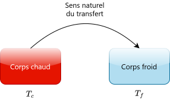
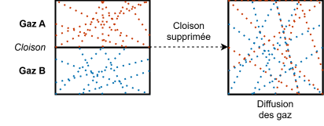

# Second Principe de la Thermodynamique

## Nécessité d'un deuxième principe

- **Phénomènes irréversibles :** Dans la nature, de nombreux processus sont irréversibles, c'est-à-dire qu'ils ne peuvent pas revenir à leur état initial sans intervention extérieure. Par exemple, la diffusion d'un gaz dans une pièce ou la conduction de chaleur d'un objet chaud vers un objet froid.

*Le transfert thermique spontané se fait toujours du corps chaud vers le corps froid, jamais l'inverse.*

- **Diffusion de particules :** Lorsqu'on ouvre une bouteille de parfum, les molécules de parfum se diffusent dans l'air. Ce processus est irréversible, car les molécules ne reviendront pas spontanément dans la bouteille. *Ce phénomène a exactement le même statut physique que celui du transfert thermique spontané.*

- **Réactions chimiques :** Les réactions chimiques spontanées, comme la combustion du bois, sont également irréversibles. Une fois que le bois a brûlé, il ne peut pas revenir à son état initial sans une intervention extérieure.

## Historiquement...

- **Sadi Carnot (1824) :** Il a introduit le concept de moteur thermique idéal, connu sous le nom de cycle de Carnot, pour comprendre les limites de l'efficacité des machines thermiques.
- **Rudolf Clausius (1850) :** Il a formulé le deuxième principe de la thermodynamique en introduisant le concept d'entropie, qui mesure le degré de désordre d'un système. 
- **Lord Kelvin (1851) :** Il a également contribué à la formulation du deuxième principe en introduisant l'idée de l'impossibilité de construire une machine thermique parfaite.

## Entropie

Pour formuler correctement le deuxième principe (et donc prendre en compte les phénomènes irréversibles), il est nécessaire d'introduire une nouvelle fonction d'état : **l'entropie**. 

C'est Clausius qui a introduit ce concept pour quantifier le degré de désordre d'un système. Son étymologie vient du grec "en" (dans) et "tropos" signifiant "transformation", "tournure" ou "possibilité de se transformer" (en grec : ἐντροπή).

C'est une fonction d'état à caractère **non-conservatif**. Elle peut s'écrire en fonction de la température, de la pression et du volume...

$$S(T,P) = S(P,V) = S(T,V)$$

(Ces trois grandeurs sont liées par l'équation d'état du système considéré.)

La variation d'entropie du système $\Delta S$ ne dépend pas de la nature de la transformation.

$$\Delta S = S_{final} - S_{initial}$$

L'entropie est **extensive**/additive. On peut donc regrouper une multitude de systèmes en un seul système global, et l'entropie du système global sera la somme des entropies individuelles.

$$\Sigma = \{\Sigma_1, \Sigma_2, \ldots, \Sigma_n\}$$

$$S_{\Sigma} = S_{\Sigma_1} + S_{\Sigma_2} + \ldots + S_{\Sigma_n}$$

$$\Delta S_{\Sigma} = \Delta S_{\Sigma_1} + \Delta S_{\Sigma_2} + \ldots + \Delta S_{\Sigma_n}$$

## Énoncé du deuxième principe de la thermodynamique

Pour un système thermodynamique, il existe une fonction d'état $S$ appelée entropie, non-conservative, dont la variation s'écrit : $\Delta S = S_{échange} + S_{production}$, où $S_{échange}$ est la variation d'entropie due aux échanges d'énergie avec l'extérieur, et $S_{production}$ est la variation d'entropie due à la production interne d'entropie dans le système. On peut aussi la réécrire sous forme différentielle : $dS = \delta S_{échange} + \delta S_{production}$.

### Terme d'échange $S_{échange}$

Il correspond à la variation d'entropie du système due aux échanges d'énergie avec l'extérieur. Il existe toujours s'il y a un transfert thermique avec le milieu extérieur.

$$\delta S_{échange} = \frac{\delta Q}{T_{ext}}$$

$$S_{échange} = \int_{\text{transfert}} \frac{\delta Q}{T_{ext}}$$

### Terme de production $S_{production}$

Le terme de production d'entropie correspond à la variation d'entropie du système due à la production interne d'entropie dans le système. Il est toujours positif (ou nul). Il est nul pour les processus réversibles, et strictement positif pour les processus irréversibles.

$$\delta S_{production} \geq 0$$

$$\begin{cases}
\delta S_{production} = 0 & \text{pour les processus réversibles} \\
\delta S_{production} > 0 & \text{pour les processus irréversibles}
\end{cases}$$

>[!NOTE] Transformations réversibles
> Les transformations réversibles sont considérées comme des processus idéalisés et hypothétiques.

La création d'entropie est indispensable à toute évolution **réelle**.

En réintégrant les deux termes, on trouve que la variation d'entropie totale du système peut s'écrire :

$$\boxed{dS = \frac{\delta Q}{T_{ext}} + \delta S_{production}}$$

### Récapitulatif

- Il existe une fonction d'état appelée entropie, non-conservative, dont la variation élémentaire s'écrit : $dS = \delta S_{échange} + \delta S_{production}$ pour un système en évolution infinitésimal.
- Cette fonction ne peut que croître ou rester constante au cours d'une transformation pour **un système isolé** : $dS \geq 0$.
  - Pour les systèmes non-isolés, la variation d'entropie peut être positive, négative ou nulle, en fonction des échanges d'énergie avec l'extérieur.
- $\delta S_{production} = 0$ si le processus est réversible, et $\delta S_{production} > 0$ si le processus est irréversible.
- Le terme de création $\delta S_{production}$ nous permet de différencier entre les transformations idéales et les transformations réelles.
- Dans un système isolé composé de deux sous-système $A$ et $B$ en interaction, la variation d'entropie totale du système est la somme des variations d'entropie de chaque sous-système : $dS = dS_A + dS_B = \delta S_{production}$, puisque les échanges d'énergie entre les deux sous-systèmes sont internes au système global.
  - $dS = dS_A + dS_B = \frac{\delta Q_A}{T_A} + \frac{\delta Q_B}{T_B}$ pour les échanges d'énergie entre les deux sous-systèmes, et $dS = \delta S_{production}$ pour la production d'entropie interne au système global. 
  - Comme $\delta Q_A = -\delta Q_B$ (échange d'énergie entre les deux sous-systèmes), on trouve que $dS = \delta S_{production} = \delta Q_A \left( \frac{1}{T_A} - \frac{1}{T_B} \right)$, ce qui montre que la variation d'entropie totale du système est liée à la différence de température entre les deux sous-systèmes.

Dans un système quelconque, on a $dU = \delta W_{réel} + \delta Q_{réel} = \delta W_{réversible} + \delta Q_{réversible}$.

En réalité, $\delta W_{réel} = -P_{ext} dV$, contrairement à $\delta W_{réversible} = -P_{int} dV$, où $P_{ext}$ est la pression exercée par l'extérieur sur le système, et $P_{int}$ est la pression interne du système.

### Pour un corps pur monophasé...

Dans le cas d'une transformation réversible, la variation élémentaire d'entropie s'écrit : $dS = \frac{\delta Q}{T_{échange}} + \delta S_{production} = \frac{\delta Q}{T}$, puisque $\delta S_{production} = 0$ pour les processus réversibles, et avec un changement au niveau de la température d'échange $T_{échange} \to T$.

<!-- why ????? -->

Comme $dU = \delta Q_{réversible} + \delta W_{réversible}$, on trouve que $dU = TdS - PdV$ pour une transformation réversible, ce qui correspond à la **relation de Gibbs**.

**Une variation élémentaire d'entropie peut être alors dûe à une variation de volume et/ou une variation d'énergie interne du système.**

En considérant une transformation isochore, on peut dériver $S$ par rapport $T$ pour obtenir :

$$\left( \frac{\partial S}{\partial T} \right)_V = \left( \frac{\partial U}{\partial T} \right)_V \left( \frac{\partial S}{\partial U} \right)_V = \frac{C_V}{T}$$

*avec $C_v$ la capacité thermique à volume constant.*

On peut aussi exprimer $dS$ en fonction de l'enthalpie $H$ du système, en utilisant la relation de Gibbs : $dH = TdS + VdP$. En considérant une transformation isobare, on trouve que $dH = TdS$, ce qui correspond à la relation de Gibbs-Helmholtz. On a donc $\left(\frac{\partial S}{\partial H}\right)_P = \frac{1}{T}$.

Cela nous permet de reconsidérer la dérivée de $S$ par rapport à $T$ dans une transformation isochore et refaire la même opération mais en utilisant la variation d'entropie $\partial H$ par rapport à la température dans nos calculs :

$$\left(\frac{\partial S}{\partial T} \right)_P = \left( \frac{\partial H}{\partial T} \right)_P \left( \frac{\partial S}{\partial H} \right)_P = \frac{C_P}{T}$$

*avec $C_p$ la capacité thermique à pression constante.*

> Ces relations seront utiles en thermochimie pour calculer les variations d'entropie à partir des capacités thermiques à pression ou volume constant.

### Pour un corps pur en phase condensée...

La dépendance par rapport à $P$ et $V$ disparaît et devient nulle, ce qui provoque :

$$dU = TdS - \cancel{PdV}$$
$$dH = TdS + \cancel{VdP}$$