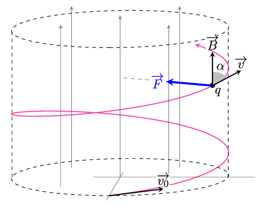
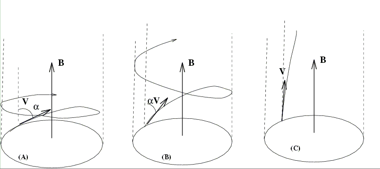
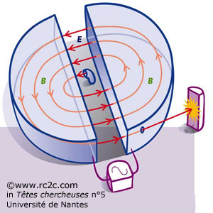
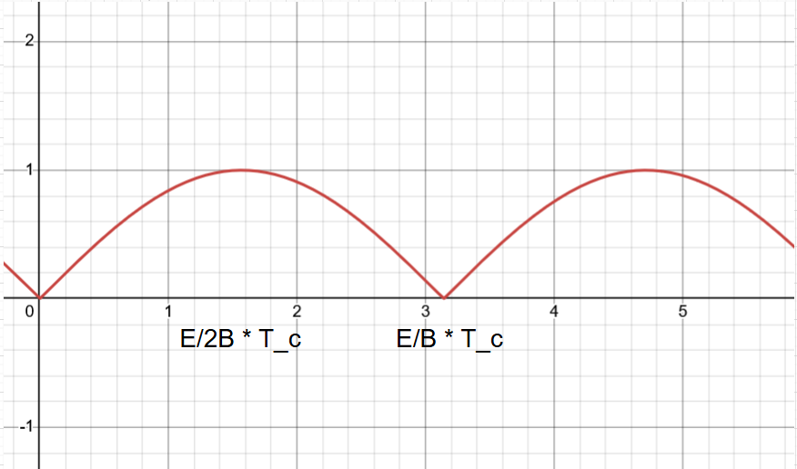
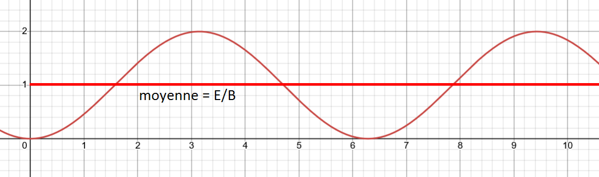

# Mouvement d’une particule chargée dans un champ électrique et/ou magnétique uniforme et permanent
*Samy Youssoufine - Déc.-Jan. 2025*

*Notes personnelles*

Il s'agit d'une nouvelle application du principe fondamental de la dynamique (PFD) à une particule chargée en mouvement dans un champ magnétique.

Nous allons définir deux champs :
- Le champ statique $\overrightarrow{B}$ qui est **indépendant du temps**. On a donc $\frac{\partial \overrightarrow{B}}{\partial t}=0$.
- Le champ uniforme, c'est-à-dire que $\overrightarrow{B}$ est constant en tout point de l'espace, donc **indépendant de la position** $\overrightarrow{r}$.

Il y a donc une différence d'indépendance (temporelle/spatiale).

Nous allons maintenant étudier le mouvement d'une particule chargée dans le champ électrique.

## Champ électrique statique et uniforme

Pour créer un champ statique $\vec{E}$, on utilise deux conducteurs parcourus par un courant électrique, par exemple deux plaques métalliques parallèles, auxquelles on va appliquer une différence de potentiel $U$.

On dit qu'il y a entre les deux plaques un **gradient de potentiel**.

Le potentiel électrique va dépendre de la position $x$ entre les deux plaques selon la relation :
$$V(x) = \frac{V_+ - V_-}{d}x + V_+ = -Ex+V_+$$
où $d$ est la distance entre les deux plaques, $V_+$ et $V_-$ sont les potentiels respectifs des plaques, et $E = \frac{V_+ - V_-}{d}=\frac Ud$ est l'intensité du champ électrique entre les plaques.

L'énergie potentielle électrique d'une particule chargée $q$ placée entre les deux plaques est donnée par :
$$E_p(x) = qV(x) = q\left(-Ex + V_+\right) = -qEx + qV_+$$

Le résultat ci-dessous peut-être utilisé comme une définition.

Cela va créer un champ électrique $\vec{E}$ entre les deux plaques, et si on place une particule chargée entre ces plaques, elle va être soumise à une force électrique $\vec{F}_E = q\vec{E}$.

* C'est exactement analogue à la force gravitationnelle $\vec{P} = m\vec{g}$. Ces deux forces ont le même caractère **conservatif**.
* Si on abandonne une particule chargée $q$ entre les deux plaques, elle va évoluer vers un état où son potentiel électrique est minimal, comme pour un objet lâché dans un champ de pesanteur.

En revanche, il faut noter que la charge $q$ peut être négative. Dans ce cas, la force électrique $\vec{F}_E$ sera dirigée dans le sens opposé au champ électrique $\vec{E}$. C'est une différence importante avec la force de pesanteur, qui est toujours dirigée vers le bas.

## Champ magnétique statique et uniforme

Pour créer un champ magnétique statique et uniforme, on utilise une bobine parcourue par un courant électrique continu. Une caractéristique importante des bobines est que le champ magnétique produit va dépendre du nombre de spires par unité de longueur $n$ et de l'intensité du courant $I$ qui la traverse. On parle de **bobines de Helmholtz**.

## Force de Lorentz

Lorsqu'une particule chargée $q$ se déplace dans un champ magnétique $\vec{B}$ et un champ électrique $\vec{E}$, elle est soumise à une force appelée **force de Lorentz**. Cette force est donnée par la relation vectorielle suivante :

$$\vec{F} = q\left(\vec{E} + \underbrace{\vec{v} \wedge \vec{B}}_{\text{antisymétrique}}\right)$$

où $\vec{v}$ est la vitesse de la particule.

**Effet symétrique du champ $\vec{E}$ :** La force électrique $\vec{F}_E$ est dirigée dans le sens du champ électrique $\vec{E}$. La trajectoire va évoluer pour être alignée avec le champ électrique.

<svg xmlns="http://www.w3.org/2000/svg" style="cursor:pointer;max-width:100%;max-height:281px;" xmlns:xlink="http://www.w3.org/1999/xlink" version="1.1" width="200px" viewBox="-0.5 -0.5 200 281" content="&lt;mxfile host=&quot;Electron&quot; agent=&quot;Mozilla/5.0 (Windows NT 10.0; Win64; x64) AppleWebKit/537.36 (KHTML, like Gecko) draw.io/28.2.5 Chrome/138.0.7204.251 Electron/37.6.1 Safari/537.36&quot; version=&quot;28.2.5&quot;&gt;&#10;  &lt;diagram name=&quot;Page-1&quot; id=&quot;7FQ_Qs9ZKZa4eaTTov-p&quot;&gt;&#10;    &lt;mxGraphModel dx=&quot;786&quot; dy=&quot;516&quot; grid=&quot;1&quot; gridSize=&quot;10&quot; guides=&quot;1&quot; tooltips=&quot;1&quot; connect=&quot;1&quot; arrows=&quot;1&quot; fold=&quot;1&quot; page=&quot;1&quot; pageScale=&quot;1&quot; pageWidth=&quot;850&quot; pageHeight=&quot;1100&quot; math=&quot;0&quot; shadow=&quot;0&quot;&gt;&#10;      &lt;root&gt;&#10;        &lt;mxCell id=&quot;0&quot; /&gt;&#10;        &lt;mxCell id=&quot;1&quot; parent=&quot;0&quot; /&gt;&#10;        &lt;mxCell id=&quot;z1Pgu79ngSkyUZZrXYOx-2&quot; value=&quot;&quot; style=&quot;endArrow=classic;html=1;rounded=0;fillColor=#dae8fc;strokeColor=#6c8ebf;&quot; edge=&quot;1&quot; parent=&quot;1&quot;&gt;&#10;          &lt;mxGeometry width=&quot;50&quot; height=&quot;50&quot; relative=&quot;1&quot; as=&quot;geometry&quot;&gt;&#10;            &lt;mxPoint x=&quot;220&quot; y=&quot;180&quot; as=&quot;sourcePoint&quot; /&gt;&#10;            &lt;mxPoint x=&quot;220&quot; y=&quot;240&quot; as=&quot;targetPoint&quot; /&gt;&#10;          &lt;/mxGeometry&gt;&#10;        &lt;/mxCell&gt;&#10;        &lt;mxCell id=&quot;z1Pgu79ngSkyUZZrXYOx-3&quot; value=&quot;&quot; style=&quot;endArrow=classic;html=1;rounded=0;fillColor=#f8cecc;strokeColor=#b85450;&quot; edge=&quot;1&quot; parent=&quot;1&quot;&gt;&#10;          &lt;mxGeometry width=&quot;50&quot; height=&quot;50&quot; relative=&quot;1&quot; as=&quot;geometry&quot;&gt;&#10;            &lt;mxPoint x=&quot;220&quot; y=&quot;180&quot; as=&quot;sourcePoint&quot; /&gt;&#10;            &lt;mxPoint x=&quot;220&quot; y=&quot;290&quot; as=&quot;targetPoint&quot; /&gt;&#10;          &lt;/mxGeometry&gt;&#10;        &lt;/mxCell&gt;&#10;        &lt;mxCell id=&quot;z1Pgu79ngSkyUZZrXYOx-4&quot; value=&quot;&quot; style=&quot;endArrow=classic;html=1;rounded=0;fillColor=#d5e8d4;strokeColor=#82b366;&quot; edge=&quot;1&quot; parent=&quot;1&quot;&gt;&#10;          &lt;mxGeometry width=&quot;50&quot; height=&quot;50&quot; relative=&quot;1&quot; as=&quot;geometry&quot;&gt;&#10;            &lt;mxPoint x=&quot;220&quot; y=&quot;180&quot; as=&quot;sourcePoint&quot; /&gt;&#10;            &lt;mxPoint x=&quot;290&quot; y=&quot;180&quot; as=&quot;targetPoint&quot; /&gt;&#10;          &lt;/mxGeometry&gt;&#10;        &lt;/mxCell&gt;&#10;        &lt;mxCell id=&quot;z1Pgu79ngSkyUZZrXYOx-5&quot; value=&quot;&quot; style=&quot;curved=1;endArrow=none;html=1;rounded=0;endFill=0;&quot; edge=&quot;1&quot; parent=&quot;1&quot;&gt;&#10;          &lt;mxGeometry width=&quot;50&quot; height=&quot;50&quot; relative=&quot;1&quot; as=&quot;geometry&quot;&gt;&#10;            &lt;mxPoint x=&quot;220&quot; y=&quot;180&quot; as=&quot;sourcePoint&quot; /&gt;&#10;            &lt;mxPoint x=&quot;310&quot; y=&quot;420&quot; as=&quot;targetPoint&quot; /&gt;&#10;            &lt;Array as=&quot;points&quot;&gt;&#10;              &lt;mxPoint x=&quot;310&quot; y=&quot;220&quot; /&gt;&#10;            &lt;/Array&gt;&#10;          &lt;/mxGeometry&gt;&#10;        &lt;/mxCell&gt;&#10;        &lt;mxCell id=&quot;z1Pgu79ngSkyUZZrXYOx-6&quot; value=&quot;Trajectoire&quot; style=&quot;text;html=1;align=center;verticalAlign=middle;whiteSpace=wrap;rounded=0;&quot; vertex=&quot;1&quot; parent=&quot;1&quot;&gt;&#10;          &lt;mxGeometry x=&quot;290&quot; y=&quot;240&quot; width=&quot;60&quot; height=&quot;30&quot; as=&quot;geometry&quot; /&gt;&#10;        &lt;/mxCell&gt;&#10;        &lt;mxCell id=&quot;z1Pgu79ngSkyUZZrXYOx-7&quot; value=&quot;F_e&quot; style=&quot;text;html=1;align=center;verticalAlign=middle;whiteSpace=wrap;rounded=0;&quot; vertex=&quot;1&quot; parent=&quot;1&quot;&gt;&#10;          &lt;mxGeometry x=&quot;150&quot; y=&quot;220&quot; width=&quot;60&quot; height=&quot;30&quot; as=&quot;geometry&quot; /&gt;&#10;        &lt;/mxCell&gt;&#10;        &lt;mxCell id=&quot;z1Pgu79ngSkyUZZrXYOx-8&quot; value=&quot;v_0&quot; style=&quot;text;html=1;align=center;verticalAlign=middle;whiteSpace=wrap;rounded=0;&quot; vertex=&quot;1&quot; parent=&quot;1&quot;&gt;&#10;          &lt;mxGeometry x=&quot;220&quot; y=&quot;140&quot; width=&quot;60&quot; height=&quot;30&quot; as=&quot;geometry&quot; /&gt;&#10;        &lt;/mxCell&gt;&#10;      &lt;/root&gt;&#10;    &lt;/mxGraphModel&gt;&#10;  &lt;/diagram&gt;&#10;&lt;/mxfile&gt;&#10;" onclick="(function(svg){var src=window.event.target||window.event.srcElement;while (src!=null&amp;&amp;src.nodeName.toLowerCase()!='a'){src=src.parentNode;}if(src==null){if(svg.wnd!=null&amp;&amp;!svg.wnd.closed){svg.wnd.focus();}else{var r=function(evt){if(evt.data=='ready'&amp;&amp;evt.source==svg.wnd){svg.wnd.postMessage(decodeURIComponent(svg.getAttribute('content')),'*');window.removeEventListener('message',r);}};window.addEventListener('message',r);svg.wnd=window.open('https://viewer.diagrams.net/?client=1&amp;page=0&amp;edit=_blank');}}})(this);"><defs/><g><g data-cell-id="0"><g data-cell-id="1"><g data-cell-id="z1Pgu79ngSkyUZZrXYOx-2"><g><path d="M 70 40 L 70 93.63" fill="none" stroke="#6c8ebf" stroke-miterlimit="10" pointer-events="stroke" style="stroke: rgb(108, 142, 191);"/><path d="M 70 98.88 L 66.5 91.88 L 70 93.63 L 73.5 91.88 Z" fill="#6c8ebf" stroke="#6c8ebf" stroke-miterlimit="10" pointer-events="all" style="fill: rgb(108, 142, 191); stroke: rgb(108, 142, 191);"/></g></g><g data-cell-id="z1Pgu79ngSkyUZZrXYOx-3"><g><path d="M 70 40 L 70 143.63" fill="none" stroke="#b85450" stroke-miterlimit="10" pointer-events="stroke" style="stroke: rgb(184, 84, 80);"/><path d="M 70 148.88 L 66.5 141.88 L 70 143.63 L 73.5 141.88 Z" fill="#b85450" stroke="#b85450" stroke-miterlimit="10" pointer-events="all" style="fill: rgb(184, 84, 80); stroke: rgb(184, 84, 80);"/></g></g><g data-cell-id="z1Pgu79ngSkyUZZrXYOx-4"><g><path d="M 70 40 L 133.63 40" fill="none" stroke="#82b366" stroke-miterlimit="10" pointer-events="stroke" style="stroke: rgb(130, 179, 102);"/><path d="M 138.88 40 L 131.88 43.5 L 133.63 40 L 131.88 36.5 Z" fill="#82b366" stroke="#82b366" stroke-miterlimit="10" pointer-events="all" style="fill: rgb(130, 179, 102); stroke: rgb(130, 179, 102);"/></g></g><g data-cell-id="z1Pgu79ngSkyUZZrXYOx-5"><g><path d="M 70 40 Q 160 80 160 280" fill="none" stroke="#000000" stroke-miterlimit="10" pointer-events="stroke" style="stroke: light-dark(rgb(0, 0, 0), rgb(255, 255, 255));"/></g></g><g data-cell-id="z1Pgu79ngSkyUZZrXYOx-6"><g><rect x="140" y="100" width="60" height="30" fill="none" stroke="none" pointer-events="all"/></g><g><g><switch><foreignObject style="overflow: visible; text-align: left;" pointer-events="none" width="100%" height="100%" requiredFeatures="http://www.w3.org/TR/SVG11/feature#Extensibility">

Trajectoire

</foreignObject><text x="170" y="119" fill="light-dark(#000000, #ffffff)" font-family="Helvetica" font-size="12px" text-anchor="middle">Trajectoire</text></switch></g></g></g><g data-cell-id="z1Pgu79ngSkyUZZrXYOx-7"><g><rect x="0" y="80" width="60" height="30" fill="none" stroke="none" pointer-events="all"/></g><g><g><switch><foreignObject style="overflow: visible; text-align: left;" pointer-events="none" width="100%" height="100%" requiredFeatures="http://www.w3.org/TR/SVG11/feature#Extensibility">

F_e

</foreignObject><text x="30" y="99" fill="light-dark(#000000, #ffffff)" font-family="Helvetica" font-size="12px" text-anchor="middle">F_e</text></switch></g></g></g><g data-cell-id="z1Pgu79ngSkyUZZrXYOx-8"><g><rect x="70" y="0" width="60" height="30" fill="none" stroke="none" pointer-events="all"/></g><g><g><switch><foreignObject style="overflow: visible; text-align: left;" pointer-events="none" width="100%" height="100%" requiredFeatures="http://www.w3.org/TR/SVG11/feature#Extensibility">

v_0

</foreignObject><text x="100" y="19" fill="light-dark(#000000, #ffffff)" font-family="Helvetica" font-size="12px" text-anchor="middle">v_0</text></switch></g></g></g></g></g></g><switch><g requiredFeatures="http://www.w3.org/TR/SVG11/feature#Extensibility"/><a transform="translate(0,-5)" xlink:href="https://www.drawio.com/doc/faq/svg-export-text-problems" target="_blank"><text text-anchor="middle" font-size="10px" x="50%" y="100%">Text is not SVG - cannot display</text></a></switch></svg>

**Effet antisymétrique du champ $\vec{B}$ :** La force magnétique $\vec{F}_B$ est perpendiculaire à la fois à la vitesse $\vec{v}$ de la particule et au champ magnétique $\vec{B}$.

Note intéressante

**Il existe 4 interactions fondamentales dans la physique**
1. **Interaction gravitationnelle :** responsable de la force de gravitation entre les masses.
2. **Interaction électromagnétique :** responsable des forces entre les charges électriques et des phénomènes magnétiques.
3. **Interaction faible (électrofaible) :** responsable des processus de désintégration radioactive de type $\beta$, soit l'émission d'un électron ou d'un positron par un noyau instable ($N \to P + ne^+$ ou $P\to N+ne^-$). Quand un électron est émis d'un noyau, l'interaction forte ne permet pas cette émission. Leur ordre de grandeur est très faible, d'où l'appellation "faible".
4. **Interaction forte :** responsable de la cohésion des noyaux atomiques. Normalement, la répulsion entre protons devrait les faire exploser, mais l'interaction forte les maintient ensemble. Leur ordre de grandeur est très élevé, d'où l'appellation "forte".

Équation du mouvement

En appliquant le principe fondamental de la dynamique (PFD) à une particule chargée $q$ de masse $m$ se déplaçant dans un champ électrique $\vec{E}$ et un champ magnétique $\vec{B}$, on obtient l'équation du mouvement suivante :

$$\frac{d\vec{v}}{dt} = \frac qm \left(\vec{E} + \vec{v} \wedge \vec{B}\right)$$

Cette formule reste valide dans le cas de la mécanique classique, tant que les vitesses impliquées sont bien inférieures à la vitesse de la lumière $c=3\cdot 10^8 \, \text{m/s}$.

Seule $\frac qm$, appelée **charge spécifique** ou **charge massique**, est expérimentalement mesurable.

**Pour l'instant, nous allons nous limiter uniquement à l'étude d'un système qui subit un champ électrique $\vec{E}$, sans champ magnétique $\vec{B}$.**

<!-- boite remarque rouge -->

Remarque

Nous n'allons étudier que le mouvement plan, donc quand $\vec{v_0}$ et $\vec{E}$ sont dans le même plan.

Nous allons redéfinir rapidement le système étudié. Il s'agit d'une particule chargée $q$ de masse $m$, de vitesse initiale $\vec{v_0}$.

Comme le champ $\vec{E}$ est indépendant du temps, on peut intégrer vectoriellement en prenant comme origine spatiale $O$ le point où la particule est lâchée à l'instant $t=0$. On va aussi définir le plan $(x,y)$ comme le plan dans lequel la particule évolue, qui contient le vecteur vitesse initial $\vec{v_0}$ et le vecteur champ électrique $\vec{E}$.

On obtient ainsi la relation :

$$\vec{v}(t) = \vec{v_0} + \frac qm \vec{E} t$$

Cela implique donc que $\vec{OM}(t)=\vec{v_0}t + \frac qm \frac{\vec{E} t^2}{2}$.

En projectant cette relation dans l'espace $(x,y,z)$, on obtient les équations horaires suivantes :

$$\begin{cases}
x(t) = v_0\cos\alpha t + \frac qm \frac{E_x t^2}{2} \\
y(t) = v_0\sin\alpha t + \underbrace{\frac qm \frac{E_y t^2}{2}}_{=0} \\
z(t) = 0 \\
\end{cases}
$$

(On a pris $\vec{E} = E\vec{u_x}$, donc $E_y = 0$)

<!-- remarque -->

Remarque

Attention, ces équations horaires ne sont valables que lorsqu'on prend l'origine spatiale $O$ au point où la particule est lâchée à l'instant $t=0$. Il faut ajouter $x_0$ et $y_0$ si l'origine spatiale est différente.

Nous allons maintenant étudier le mouvement de cette particule, globalement.

**Le cas où $v_{0y} = 0$ est trivial.**

En résumé, la particule va suivre une trajectoire rectiligne, accélérée dans la direction du champ électrique $\vec{E}$. Elle va d'abord se diriger vers la direction du vecteur vitesse initial $\vec{v_0}$, puis va être déviée par le champ électrique $\vec{E}$, et enfin va se diriger dans la direction de ce champ électrique.

**Étude du cas général où $v_{0y} \neq 0$**

La vitesse initiale $\vec{v_0}$ fait un angle $\alpha$ avec le champ électrique $\vec{E}$. Elle n'est donc pas parallèle à ce champ.

On peut écrire l'équation de la trajectoire $x(y)$ en éliminant le paramètre temps $t$.

On trouve ainsi :

$$x(y)=\frac{qE}{2mv_0^2\cos\alpha}y^2 + y\cot(\alpha)$$

La trajectoire suivie ici est une parabole (déviation parabolique).

Si on fixe quelques paramètres initiaux, on peut observer l'effet de la position initiale sur la trajectoire de la particule chargée. En effet, celle-ci restera la même, mais décalée en fonction de la position initiale. Elle sera donc translatée.

## Aspects énergétiques

Le potentiel électrique $V$ dans un champ électrique uniforme $\vec{E}$ varie linéairement avec la position $x$ selon la relation :

$$V(x) = -Ex + \text{constante}$$

L'énergie potentielle d'une charge $q$ dans un champ électrostatique $\vec{E}$ est donnée par la relation :

$$E_p(x) = -qV\\\implies \boxed{E_p(x)=-qEx + \text{constante}}$$

(comme vu précédemment)

La force électrique $\vec{F}_E = q\vec{E}$ est conservative, donc le travail de cette force entre deux points $A$ et $B$ est égal à la variation de l'énergie potentielle électrique entre ces deux points :

$$W_{A\to B}(\vec{F}_E) = E_p(A) - E_p(B)$$

Démonstration

$$\vec{f}=q\vec{E}=qE\vec{u_x}$$

$$\delta W(\vec{f}) = \vec{f} \cdot d\vec{OM}=qE\cdot dx$$

$$\delta W(\vec{f}) = -dE_p$$

$$\dots \text{CQFD.}$$

On peut aussi appliquer le théorème de l'énergie cinétique (TEC) entre deux points $A$ et $B$ :

$$\Delta E_c = W_{A\to B}(\vec{F}_E) \\\implies E_c(B) - E_c(A) = qE(x_B-x_A)$$

**Attention : Il faut faire attention au signe de la tension et de la charge pour bien définir les positions etc. etc. etc.** Si la particule étudiée a une charge négative, elle va se diriger dans le "sens croissant du potentiel électrique", soit la plaque positive. Dans le cas contraire, elle va se diriger dans le "sens décroissant du potentiel électrique", soit la plaque négative.

On peut développer l'expression du théorème de l'énergie cinétique (TEC) pour obtenir :

$$\Delta E_c = qE(x(t_2)-x(t_1))$$

$$\implies \Delta E_c=qE\left(v_0\cos\alpha (t_2 - t_1) + \frac qm \frac{E(t_2^2 - t_1^2)}{2}\right)$$

$$\implies \boxed{\Delta E_c = \frac{q^2 E^2}{m} \frac{(t_2^2 - t_1^2)}{2} + qE v_0\cos\alpha (t_2 - t_1)}$$

On étudie ensuite le signe de $\Delta E_c$ pour déterminer si la particule accélère ou décélère.

On peut aussi étudier le signe de $\frac{dE_c}{dt} = q\vec{E}\cdot \vec{v} = \mathcal{P}(\vec{F}_E)$.

Si cette dernière puissance est strictement positive, alors la particule est accélérée. Si elle est strictement négative, alors la particule est décélérée.

**Applications : accélérateurs linéaires**

## Champ magnétique $\vec{B}$

$$m\frac{d\vec{v}}{dt} = q\vec{v} \wedge \vec{B}$$
$$\implies \frac{d\vec{v}}{dt} = \frac qm \vec{v} \wedge \vec{B}$$
$$\implies \boxed{\frac{d\vec{v}}{dt} = \vec{\Omega} \wedge \vec{v}} \text{ avec } \vec{\Omega} = -\frac qm \vec{B}$$

On note $\omega_c = ||\vec{\Omega}|| = \frac{|q|B}{m}$ la pulsation cyclotron.

Comme vu précédemment, le champ magnétique n'agit pas sur la valeur/module de la vitesse, mais uniquement sur sa direction. Donc l'énergie cinétique $E_c$ reste constante. La norme de la vitesse est conservée. **Donc le travail de la force magnétique est nul.**

$$\delta W(\vec{F}_B) = \vec{F}_B \cdot d\vec{OM} = q(\vec{v} \wedge \vec{B}) \cdot \vec{v} dt = 0$$

Le vecteur $\Omega$ est constant (car $\vec{B}$ est constant).

Donc on peut intégrer l'équation vectorielle :

$$\vec{v} = \vec{\Omega} \wedge \vec{OM} + \vec{C}$$

Si on pose les conditions initiales suivantes :

$$\begin{cases} \vec{OM}(t=0) = \vec{OM}_0 \\ \vec{v}(t=0) = \vec{v}_0 \end{cases}$$

$$\vec{v}=\vec{\Omega} \wedge (\vec{OM} - \vec{OM}_0) + \vec{C}$$

$$\vec{v}=\vec{\Omega} \wedge \vec{OM} + \vec{v}_0$$

On peut dériver cette relation pour obtenir l'équation différentielle suivante :

$$\frac{d\vec{OM}}{dt} = \vec{\Omega} \wedge \vec{OM} + \vec{v}_0$$

On va définir le plan $(y,z)$ comme le plan auquel $\vec{v}_0$ et $\vec{B}$ appartiennent.

On va effectuer les différentes projections dans le repère $(x,y,z)$, avec $\vec{B} = B\vec{u_z}$.

$$\begin{cases}
\dot{x}= \frac{qB}m y + v_{0x}\\
\dot{y}= \frac{-qB}m x + v_{0y}\\
\dot{z}= v_{0z} \implies z(t) = v_{0z}t + \cancel{z_0} \text{ (si on prend } z_0=0\text{)}
\end{cases}
$$

<!-- info box yellow -->

Équations horaires et trajectoire

Pour obtenir les équations horaires $x(t)$ et $y(t)$, on peut procéder de deux manières :
- Soit en dérivant l'équation de $\dot{x}$ pour obtenir $\ddot{x}$, puis en remplaçant $\dot{y}$ par son expression dans l'équation de $\dot{y}$. On obtient ainsi une équation différentielle du second ordre en $x$.
- Soit en utilisant des nombres complexes.

On obtient les équations différentielles suivantes :

$$\begin{cases}
\ddot{x} + \Omega^2 x = \frac{qB}{m} v_{0y} \\
\ddot{y} + \Omega^2 y = -\frac{qB}{m} v_{0x}
\end{cases}$$

Pour simplifier les calculs, on va poser $v_{0x} = 0$.

On obtient ainsi les équations horaires suivantes :

$$\begin{cases}
x(t)=\frac{m v_{0y}}{qB} (1 - \cos(\Omega t)) \\
y(t)=\frac{m v_{0y}}{qB} \sin(\Omega t)
\end{cases}$$

$$\begin{cases}x(t)=\frac{v_{0y}}{\Omega} (1 - \cos(\Omega t))
x(t)=\frac{v_{0y}}{\Omega} (1 - \cos(\Omega t)) \\
y(t)=\frac{v_{0y}}{\Omega} \sin(\Omega t) \\
z(t)=v_{0z}t
\end{cases}$$

On peut remarquer que dans le plan $(x,y)$, la trajectoire est circulaire, avec un rayon $R = \frac{v_{0y}}{\Omega} = \frac{m v_{0y}}{|q| B}$.

On obtient l'équation de la trajectoire circulaire suivante :

$$(x - \frac{m v_{0y}}{qB})^2 + y^2 = (\frac{m v_{0y}}{qB})^2$$

$$\boxed{(x - \frac{v_{0y}}{\Omega})^2 + y^2 = (\frac{v_{0y}}{\Omega})^2}$$

<em>Trajectoire circulaire d'une particule chargée dans un champ magnétique</em>

**Le sens de rotation va dépendre du signe de la charge $q$.**

**Utilisation des nombres complexes pour décrire le mouvement :**

On rappelle que $x(t)$ et $y(t)$ sont donnés par les relations suivantes :
$$\begin{cases}
\dot{x}= \frac{qB}m y + v_{0x}\\
\dot{y}= -\frac{qB}m x + v_{0y}\\
\end{cases}$$

On peut définir le nombre complexe suivant :
$$Z(t) = x(t) + iy(t)$$

On dérive cette relation pour obtenir :
$$\dot{Z}(t) = \dot{x}(t) + i\dot{y}(t)$$

En remplaçant $\dot{x}$ et $\dot{y}$ par leurs expressions, on obtient :
$$\dot{Z}(t) = \frac{qB}m y + v_{0x} + i\left(-\frac{qB}m x + v_{0y}\right)$$

On peut réécrire cette relation sous la forme suivante :
$$\dot{Z}(t) = i\frac{qB}m Z(t) + (v_{0x} + iv_{0y})$$

Pour simplifier les calculs, on va poser $v_{0x} = 0$.

On obtient ainsi la relation suivante :

$$\dot{Z}(t) = \frac{qB}m (y - i x) + i v_{0y}$$

On peut réécrire cette relation sous la forme suivante :
$$\dot{Z}(t) = -i\Omega Z(t) + i v_{0y}$$

Donc

$$\boxed{\dot{Z}(t) + i\Omega Z(t) = iv_{0y}}$$

Ceci est une équation différentielle linéaire du premier ordre. On la résout facilement pour trouver :

$$Z(t) = \frac{v_{0y}}{\Omega} + Ce^{-i\Omega t}$$

On obtient donc $\boxed{Z(t)=\frac{v_{0y}}{\Omega} (1 - \cos(\Omega t)) + i\frac{v_{0y}}{\Omega} \sin(\Omega t)}$, ce qui redonne bien les équations horaires précédentes.

**Note additionnelle :** Le scalaire $\vec{v} \cdot \vec{B}$ est constant au cours du temps. En effet : 
$$\frac{d}{dt}(\vec{v} \cdot \vec{B}) = \frac{d\vec{v}}{dt} \cdot \vec{B} + \vec{v} \cdot \frac{d\vec{B}}{dt} = 0$$

Précession de Larmor

Le vecteur vitesse $\vec{v}$ de la particule chargée effectue, en quelque sorte, une rotation autour de la direction du champ magnétique $\vec{B}$ à la pulsation cyclotron $\omega_c = \frac{|q|B}{m}$. On dit que la particule subit une précession de Larmor.

**Mouvement hélicoïdal :** Si la particule possède une composante de vitesse parallèle au champ magnétique $\vec{B}$, elle va suivre une trajectoire hélicoïdale autour de la direction de $\vec{B}$, avec une vitesse constante dans cette direction.

## Action de forces électriques et magnétiques combinées

On reprend l'équation du mouvement général :
$$\frac{d\vec{v}}{dt} = \frac qm \left(\vec{E} + \vec{v} \wedge \vec{B}\right)$$

---

## Récapitulatif post-vacances

**On étudiera uniquement l'action du champ électrique dans cette partie :**
- Particule définie par $q,m,\vec{v_0}$ dans un référentiel galiléen.
- Action d'un champ électrique uniforme et constant $\vec{E}$.
- Équation du mouvement : $\frac{d\vec{v}}{dt} = \frac qm \vec{E}$
- Énergie cinétique : $\frac d{dt} E_c = q\vec{E}\cdot \vec{v} = \mathcal{P}(\vec{F}_E)$
  - Si $\vec{E}\cdot \vec{v} > 0$ : accélération
  - Si $\vec{E}\cdot \vec{v} < 0$ : décélération
  - Selon le signe de $q$, la particule va vers la plaque positive (potentiel élevé) ou négative (potentiel faible).
- Trajectoire parabolique dans le plan $(\vec{v_0}, \vec{E})$.

**Etude du champ magnétique $\vec{B}$**
- Force magnétique : $\vec{F}_m = q\vec{v} \wedge \vec{B}$
  - Cette force ne développe pas de puissance parce que le produit scalaire de $\vec{F}_m$ avec le vecteur vitesse est nul ($(q\vec{v} \wedge \vec{B}) \cdot \vec{v} = 0$).
  - Donc l'énergie cinétique $E_c$ est constante (${d\vec{v}}{dt}=\vec{0}$). **Le mouvement est uniforme**.
- Équation du mouvement : $\frac{d\vec{v}}{dt} = \frac qm \vec{v} \wedge \vec{B}$ (équation différentielle)
- Le champ magnétique n'a donc qu'un unique effet : celui de **courber la trajectoire**.
- Si le vecteur vitesse $\vec{v_0}$ est perpendiculaire à $\vec{B}$, la **trajectoire est circulaire** dans le plan perpendiculaire à $\vec{B}$.

*On peut clairement imaginer à travers ce schéma comment si le vecteur vitesse $\vec{v_0}$ n'est pas perpendiculaire à $\vec{B}$, la trajectoire sera hélicoïdale, et que s'il n'a pas de composante selon $\vec{B}$, la trajectoire sera circulaire.*

---

# Cyclotron de Lawrence

Le cyclotron est un accélérateur de particules inventé par Ernest O. Lawrence en 1932. Il utilise un champ magnétique pour courber la trajectoire des particules chargées et un champ électrique alternatif pour les accélérer.

À l'intérieur du cyclotron, dans les cavités, les particules sont **soumises à l'action unique du champ magnétique**. L'effet électrique n'entre pas en jeu. Entre les deux cavités, les particules sont accélérées par un champ électrique alternatif, et là-bas, l'effet magnétique n'entre pas en jeu.

*Schéma détaillé d'un cyclotron (la tension est sinusoïdale ici, pas carré comme on étudiera ci-dessous)*

**Étude du cyclotron original construit en 1932**

On propose d'étudier le premier cyclotron construit. L'appareil a les caractéristiques suivantes :
- Rayon : 14 cm.
- Différence de potentiel entre les deux cavités : 4000 V.
- Vitesse initiale des particules : nulle.
- On admet que la tension générée entre les deux cavités est alternative mais **carrée**, de pulsation $\omega_c$, telle que $T=\frac{2\pi}{\omega_c}$ (pour simplifier les calculs).
- On admet que les protons étudiés sont classiques (non relativistes) afin de conserver la relation $E_c = \frac 12 mv^2$. En mécanique relativiste, un nouveau facteur $\gamma=\frac{1}{\sqrt{1-\frac{v^2}{c^2}}}$ entre en jeu (relativité restreinte).
  - On dit que les protons restent classiques parce que l'énergie cinétique va être bien inférieure à l'énergie de masse (qui est $E_0 = mc^2$).
- On néglige le temps de passage lors des phases d'accélération entre les deux cavités (temps de passage très faible devant la période $T$).

On cherche à déterminer :
- La vitesse maximal des protons accélérés.
- La tension accélératrice qu'il faut appliquer entre les deux cavités pour que les protons puissent être accélérés de manière synchrone avec le champ électrique alternatif.

→ **Détermination de la vitesse maximale des protons accélérés**
La vitesse maximale atteinte par les protons est de : $v=\sqrt{2E_c/m}$.

On sait que l'énergie cinétique sera conservée tout au long du déplacement dans le cyclotron, sauf lors des passages entre les deux cavités où les protons sont accélérés par le champ électrique. On a donc $E_c = 1,2$ MeV (énergie cinétique maximale atteinte par les protons).

On effectue donc l'application numérique suivante pour trouver $v=1,52\cdot 10^7$ m/s.

**Remarque :** $\frac vc = 0,05$, donc la vitesse des protons est bien inférieure à la vitesse de la lumière. On peut donc considérer que les protons sont classiques.

→ **Détermination de la tension d'accélération**

On applique le **théorème de l'énergie cinétique** entre les deux plaques :

$$\frac12 mv^2 - 0 = qU$$

$$\implies U = \frac{mv^2}{2q}=\frac{E_c}{q}$$

En effectuant l'application numérique :

$$U = 1,2\times10^6 \text{ V}$$

→ **Détermination de la fréquence du champ accélérateur**

La tension d'accélération doit être synchrone avec les temps de révolution dans le champ magnétique. Elle doit donc avoir une période $T$ égale à la période cyclotronique $T_c$ des protons dans le champ magnétique.

$$T=T_c = \frac{2\pi}{\omega_c}$$

*(on rappelle que le temps de passage entre les deux cavités est négligé)*

L'expression de la fréquence du champ accélérateur est donc : $f=f_c = \frac{\omega_c}{2\pi}$. On rappelle que $\omega_c = \frac{|q|B}{m}$.

**Pendant chaque passage entre les deux plaques, les protons vont gagner en vitesse ; ils vont être accélérés.**

On souhaite déterminer l'accélération subie par les protons entre ces deux plaques.

On applique le théorème de l'énergie cinétique entre les deux plaques :

$$\Delta E_c = qU$$
$$\implies \frac12 m (v_{n+1}^2 - v_n^2) = qU$$
$$\implies v_{n+1}^2 = v_n^2 + \frac{2qU}{m}$$

En effectuant un calcul avec une somme téléscopique, on trouve l'expression de la vitesse après $n$ passages entre les deux plaques en fonction de la vitesse initiale $v_0$, qui est nulle ici :

$$v_n^2 = n\frac{4qU}{m}$$

<b><i>NOTE : S'ASSURER DE L'EXPRESSION !</b></i>

On peut donc en déduire le nombre de passages $n$ nécessaires pour atteindre la vitesse maximale $v$ :

$$n = \frac{mv^2}{4qU}$$

On remplace $v$ par $v_max$ (la valeur à la fin du cyclotron) pour obtenir le nombre total de passages entre les deux plaques :

$$n = \frac{E_cmax}{2qU}$$

**En effectuant l'application numérique, on trouve $n=150$ passages entre les deux plaques pour atteindre la vitesse maximale des protons.**

→ **Détermination de la valeur du champ magnétique B**

On a $v_{max} = R\omega_c = R\frac{qB}{m}$.

Donc $B = \frac{mv_{max}}{qR}$.

En effectuant l'application numérique, on trouve $B=1,43$ T.

## Exercice d'application (3)

Dans cet exercice, on étudiera l'action du champ magnétique et du champ électrique sur une particule chargée.

Ces deux champs seront orthogonaux entre eux.

*Voir instructions dans la présentation PPT.*

1. **Etude du mouvement de $M$**

On applique le principe fondamental de la dynamique (PFD) à la particule chargée $q$ de masse $m$ :

$$m\frac{d\vec{v}}{dt} = q\vec{E} + q\vec{v} \wedge \vec{B}$$

On étudie le mouvement dans le plan $(i,j)$, avec $\vec{E} = E\vec{j}$ et $\vec{B} = B\vec{k}$.

On projette le PFD dans le repère $(i,j,k)$ :

$$\begin{cases}
m\dot{v_i} =  qv_j B \\
m\dot{v_j} = qE -qv_i B \\
m\dot{v_k} = 0 \implies v_k = cte = 0
\end{cases}$$

$$\implies \begin{cases}
\ddot{v_i} = \frac{qB}m[\frac{qE}m-\frac{qB}m v_i] \\
\ddot{v_j} + \frac{q^2B^2}{m^2} v_j = \frac{q^2EB}{m^2}
\end{cases}$$

On résout les équations différentielles pour obtenir les expressions de $v_i(t)$ et $v_j(t)$.

On a donc :
$$\begin{cases}
v_i(t) = \frac{E}{B} (1-\cos(\omega_c t)) \\
v_j(t) = \frac{E}{B} \sin(\omega_c t)
\end{cases}$$

On intègre ces expressions pour obtenir les équations horaires $x(t)$ et $y(t)$ :

$$\begin{cases}
y(t) = \frac{E}{B\omega_c}(1 - \cos(\omega_c t)) = \frac1{\omega_c}v_i(t) \\
x(t) = \frac{E}{B}t -\frac{E}{B\omega_c} \sin(\omega_c t) + \cancel{x_0} \text{ (si on prend } x_0=0\text{)}
\end{cases}$$

**Equation de trajectoire (courbe paramétrée par $\theta$)**

$$\begin{cases}
y(\theta)=\frac{E}{B\omega_c}(1 - \cos\theta) \\
x(\theta)=\frac{E}{B\omega_c}(\theta - \sin\theta)
\end{cases}$$

*(sachant qu'on a $\omega_c t = \theta$)*

On remarque que la trajectoire est une cycloïde.

Le mouvement de la particule est limité à $y\ge 0$.

La **vitesse de dérive** selon $x$ est donnée par : $v_x(t) = \frac{E}{B}(1 - \cos(\omega_c t))$.

**2. Détermination de la vitesse moyenne :**

La vitesse moyenne selon $x$ est donnée par $<v_x> = \frac{E}{B}$.