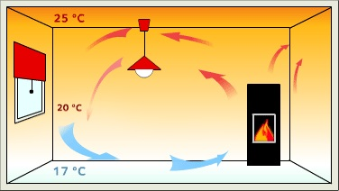
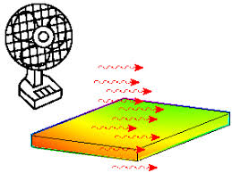
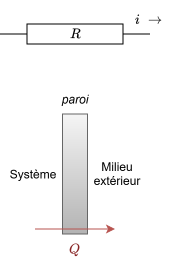
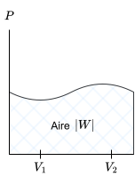
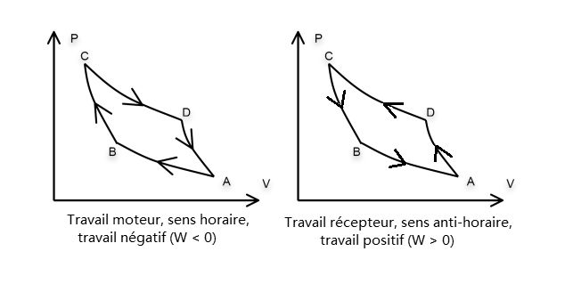
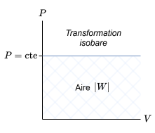
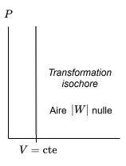

# Premier principe de la thermodynamique
*Notes personelles - SY0226*

Le principe de la thermodynamique, qu'on appelle aussi le principe des bilans énergétiques ou encore le principe de conservation de l'énergie, nous permet de faire le lien entre les différentes formes d'énergie, et de comprendre comment elles se transforment les unes en les autres.

Nous n'allons pas nous intéresser au sens de l'évolution d'un système, et si cette évolution est réversible ou irréversible, mais plutôt aux échanges d'énergie qui ont lieu au sein d'un système, et entre ce système et son environnement.

En mécanique, le bilan énergétique est donné grâce au théorème de l'énergie mécanique, qui nous permet de lier le travail des forces non-conservatives à la variation de l'énergie mécanique d'un système.

$$\Delta E_m = W_{nc}$$

$$\frac{dE_m}{dt} = P(\vec f_{nc})$$

L'énergie mécanique n'est donc pas conservée en présence de forces non-conservatives. Cette travail, toujours négatif et qui dépend du travail suivi (force non-conservative), correspond à une dissipation d'énergie mécanique.

## Étude de l'énergie interne via un exemple

Prenons comme exemple simple un ressort situé dans une enceinte calorifugée, c'est-à-dire sans échange de chaleur avec l'extérieur, et soumis à une force de frottement. Lorsqu'on déplace le ressort est déplacé de sa position d'équilibre, il effectuera des oscillations avant de s'arrêter. L'énergie mécanique du ressort est alors dissipée par les forces de frottement (on considérera uniquement les frottements fluides), et transformée en énergie thermique. L'énergie mécanique de départ est donc **entièrement transférée/restituée** vers l'air.

Il est donc nécessaire de faire un suivi thermodynamique de l'air, et il faut mesurer l'évolution de la température de l'air pour déterminer ce transfert. **L'énergie interne** de l'air va donc évoluer.

On l'appelle **énergie interne** parce qu'elle ne peut pas être observée de manière macroscopique, contrairement à l'énergie mécanique qui peut être observée à travers les mouvements d'un système. L'énergie interne est une énergie microscopique.

En utilisant le modèle des gaz parfaits, on peut exprimer l'évolution de cette énergie interne en fonction de la température de l'air, et ainsi faire le lien entre les différentes formes d'énergie, de la manière suivante :

$$dU = C_v dT$$

$$\Delta U = U_2 - U_1 = C_v (T_2 - T_1)$$

Comme $T_2 > T_1$, on a $\Delta U > 0$, ce qui correspond à une augmentation de l'énergie interne de l'air, et donc à un transfert d'énergie mécanique vers l'énergie interne de l'air.

Et sachant que le système est isolé, l'énergie mécanique du pendule est entièrement transférée vers l'énergie interne de l'air, ce qui correspond à une conservation de l'énergie totale du système. On peut écrire :

$$\underbrace{E_m}_{pendule} + \underbrace{U}_{air} = \text{constante}$$

On va donc définir une nouvelle grandeur énergétique pour un **système fermé et isolé**, donc sans échange de matière et d'énergie avec l'extérieur, qui correspond à la somme de l'énergie mécanique et de l'énergie interne :

$$E_{total} = E_m + U$$

>[!NOTE]Système isolé
> Un système est isolé s'il n'échange ni matière ni énergie avec son environnement. Une surface de contrôle entoure le système, et aucune interaction ne peut la traverser. Elle agit comme une frontière *imperméable*.
>
> Notre système-exemple est donc constitué de deux parties : le pendule et l'air, qui sont tous les deux isolés de l'extérieur, mais qui peuvent échanger de l'énergie entre eux. Le pendule perd de l'énergie mécanique, tandis que l'air gagne de l'énergie interne, mais la somme des deux énergies reste constante.

>[!TIP]Travail des forces non-conservatives
> Le travail des forces non-conservatives $W_{nc}$ comme celui des frottements fluides dans notre exemple, permet de transformer l'énergie mécanique en énergie thermique. C'est pour ça qu'il y a une évolution *thermodynamique*.

L'énergie interne du système est définie comme étant la somme de l'énergie cinétique microscopique et de l'énergie potentielle microscopique des particules qui composent le système. Il s'agit aussi d'une **fonction d'état**

$$U = E_{cinétique\ microscopique} + E_{potentielle\ microscopique}$$

L'énergie potentielle microscopique peut elle aussi être décomposée en plusieurs sous énergies potentielles microscopiques, liées par exemple à :

- des interactions entre les molécules, atomes et particules du systèmes
- des termes constants dans le cadre de l'évolution thermodynamique, liés à :
  - des interactions entre les électrons et les noyaux des atomes
  - des interactions entre les électrons eux-mêmes
  - des interactions entre les noyaux eux-mêmes

L'énergie mécanique du système est définie comme étant la somme de l'énergie cinétique macroscopique et de l'énergie potentielle macroscopique (associées à des forces externes) du système.

$$E_m = E_{c,macro} + E_{p,macro}$$

## Énoncé du premier principe

Le premier principe de la thermodynamique énonce que l'énergie interne d'un système fermé et isolé est conservée et constante.

Considérons par exemple *l'univers*, défini comme étant un système fermé et isolé, qui contient tous les systèmes physiques. L'énergie totale de l'univers est donc constante, et il n'y a pas d'échange d'énergie avec l'extérieur (parce qu'il n'y a pas d'extérieur).

Une conséquence directe de cette notion d'univers isolé et que l'évolution de l'énergie interne d'un système fermé peut être étudiée de la manière suivante :

$$\Delta E_{univers} = \Delta \underbrace{E_{système}}_{E_\Sigma} + \Delta E_{environnement} = 0$$

On a donc $Delta E_\Sigma = - \Delta E_{environnement}$, ce qui signifie que l'évolution de l'énergie interne du système est égale à l'opposé de l'évolution de l'énergie de son environnement.

- Si $\Delta E_{\Sigma} > 0$, alors le système gagne de l'énergie interne, et il y a un transfert d'énergie vers le système. **Le système gagne de l'énergie depuis le milieu extérieur.**
- Si $\Delta E_{\Sigma} < 0$, alors le système perd de l'énergie interne, et il y a un transfert d'énergie depuis le système. **Le système cède de l'énergie au milieu extérieur.**

>[!NOTE]Production interne
> Une hypothèse que nous avons réalisé implicitement est que le système ne peut pas produire d'énergie. Mais le système peut être le siège de réactions chimiques et d'autres transformations physiques.
>
> L'influence de cette production interne est détaillé ci-dessous.

Considérons un système $\Sigma$ en évolution. Nous allons étudier sa transformation élémentaire pour une grandeur $X$.

$$X \xrightarrow{\text{transformation élémentaire}} X + \mathrm dX$$

Et on peut définir cette variation élémentaire de la manière suivante :

$$\mathrm d X = \delta X_{éch ~ \leftrightarrow ~ext.} + \delta X_{prod\ int}$$

> Dans le cas, par exemple, de l'eau chauffée grâce à un thermoplongeur (résistance chauffante) dans un système isolé, la variation de l'énergie interne peut déterminée à partir de la puissance électrique fournie $P = R\cdot I^2$.

On peut ensuite étudier la variation de l'énergie du système de la manière suivante :

$$\Delta E_\Sigma = W+Q$$

$W$ et $Q$ sont des **grandeurs algébriques**. Elles sont comptées positivement uniquement si elles sont reçues par le système.

Cela nous permet de conclure sur le premier principe de la thermodynamique, qui énonce que l'énergie interne d'un système fermé et isolé est conservée et constante, et que les variations d'énergie interne d'un système sont dues à des échanges d'énergie avec l'extérieur, sous forme de travail ou de chaleur.
<!-- 
**Pour récapituler...**

tableau récapitulatif du premier principe -->

## Transferts d'énergie

### Transfert mécanique

Un transfert mécanique est défini 

### Transfert thermique

Un transfert thermique apparaît lorsque la paroi délimitant le système n'est pas calorifugée et qu'elle est perméable à la chaleur. Il y a alors un échange de chaleur entre le système et son environnement, ce qui peut entraîner une variation de l'énergie interne du système.

Ces échanges de chaleur peuvent être causés par des différences de température entre le système et son environnement, ou par des processus de conduction, de convection ou de rayonnement thermique.

- **La conduction thermique** se produit lorsque la chaleur est transférée à travers un matériau solide, sans mouvement de matière. Par exemple, lorsqu'on touche une surface chaude, la chaleur est transférée de la surface à notre main par conduction.
  - Lorsque la paroi du système est *diathermane*, perméable à la chaleur, il y a contact thermique avec l'extérieur.
  - Lorsque la paroi du système est *athermane*, imperméable à la chaleur, il n'y a pas de contact thermique avec l'extérieur. Dans le cas idéal, on considère que la paroi est calorifugée, c'est-à-dire qu'elle est parfaitement isolante, et qu'il n'y a pas d'échange de chaleur avec l'extérieur. Le système est aussi dit **adiabatique**.

- **La convection thermique** est un transport d'énergie dû à un déplacement de matière. On peut distinguer deux types de convections : une convection *naturelle*, qui est causée par des différences de densité dans un fluide, et une convection *forcée*, qui est causée par une action mécanique externe, comme un ventilateur ou une pompe.

*Un exemple de convection naturelle via système de chauffage*

*Un exemple de convection forcée via ventilateur*

- **Le rayonnement thermique** est un transfert d'énergie qui se produit par l'émission de rayonnements électromagnétiques, comme la lumière ou les ondes radio. **Tous les corps émettent du rayonnement thermique en fonction de leur température**, et ce rayonnement peut être absorbé par d'autres corps, ce qui entraîne un transfert d'énergie.

>[!NOTE]Analogie thermo-électrique de la conduction
> On peut faire une analogie entre les transferts thermiques et les transferts électriques. Par exemple, considérons une résistance traversée par un courant $i$. Quand $R \to 0$, le courant $i$ devient très grand, ce qui correspond à une situation de court-circuit. $i \nearrow$.
> 
> De la même manière, lorsqu'une paroi est très conductrice, elle permet un transfert de chaleur important, ce qui correspond à une situation de contact thermique parfait $Q \nearrow$.
>
> Inversement, lorsqu'une paroi est très isolante, elle empêche le transfert de chaleur, ce qui correspond à une situation d'adiabatisme parfait $Q \searrow$. Elle correspond électriquement à un circuit où $R \to \infty$, ce qui empêche le passage du courant. $i \searrow$.

*Schéma récapitulatif de l'analogie thermo-électrique*

## Transformation adiabatique

Une transformation adiabatique est une transformation dans laquelle il n'y a pas d'échange de chaleur entre le système et son environnement. Cela signifie que la paroi du système est parfaitement isolante, et qu'il n'y a pas de contact thermique avec l'extérieur.

- **Pour des transformations rapides**, il n'y a pas le temps pour que la chaleur soit transférée, ce qui correspond à une situation d'adiabatisme quasi-parfait. On admettra très souvent que les transformations rapides sont adiabatiques.

>[!TIP]Temps caractéristique
> Pour une transformation rapide, le système n'a pas "le temps" de transférer de la chaleur, ce qui correspond à une situation d'adiabatisme quasi-parfait. Cela signifie qu'il y a un temps caractéristique de transfert de chaleur, qui est lié à la nature du système et à sa configuration. Si la transformation se déroule sur une durée beaucoup plus courte que ce temps caractéristique, alors on peut considérer que la transformation est adiabatique.

>[!IMPORTANT]Transformation adiabatique et isotherme
> Il ne faut pas confondre une transformation adiabatique avec une transformation isotherme.
> 
> Une transformation isotherme est une transformation dans laquelle la température du système reste constante. Le système peut échanger de l'énergie avec l'extérieur, mais il doit compenser cette énergie par un transfert de chaleur pour maintenir sa température constante.
> 
> Si $Q=0$, alors le système est isolé thermiquement. En revanche, si $Q \ne 0$, alors le système échange de la chaleur avec l'extérieur pour maintenir sa température constante. Le milieu extérieur agit comme un thermostat ou un réservoir thermique/de chaleur, et on peut le considérer comme un système à capacité thermique infinie.
> 
> En revanche, une transformation adiabatique peut entraîner une variation de la température du système, et donc de son énergie interne, même s'il n'y a pas d'échange de chaleur avec l'extérieur ($Q=0$).

## Travail des forces de pression

Prenons l'exemple du travail d'une force exercée par un piston. Nous allons négliger la masse du piston.

L'expression de la force exercée par le piston est donnée par :

$$\vec F_p = -P_{ext} S \vec u_z$$

Si le déplacement élémentaire du piston est :

$$d\vec l = dz \vec u_z$$

Alors le travail élémentaire de cette force est donné par : 
$$\delta W_p = \vec F_p \cdot d\vec l = -P_{ext} S dz$$

$$\delta W_p = -P_{ext} dV$$

### Dans le cas d'une transformation monobare

Et le travail total de cette force est donné par :

$$W_p = - \int_{V_1}^{V_2} P_{ext} dV = -P_{ext} \int_{V_1}^{V_2} dV$$

$$W_p = -P_{ext} \Delta V$$

On a donc déduit l'expression non-élémentaire du travail d'une force de pression dans le cas d'une transformation monobare, c'est-à-dire lorsque la pression extérieure $P_{ext}$ est constante.

### Dans le cas d'une transformation quasi-statique

La pression extérieure $P_{ext}$ est alors égale à la pression intérieure $P_{int}=P$ (en constant équilibre avec l'extérieur). L'expression du travail de la force de pression devient alors :

$$W_p = - \int_{V_1}^{V_2} P dV$$

Évidemment, les transformations réelles ne sont pas quasi-statiques, mais comme on effectue le bilan d'énergie entre les états initial et final, on peut faire l'hypothèse que le travail de la force de pression est égal à celui d'une transformation quasi-statique, ce qui nous permet d'utiliser l'expression ci-dessus pour calculer le travail de la force de pression dans une transformation réelle.

L'état du système lors de la transformation réelle à un instant $t$ peut être différent de l'état hypothétique que nous utilisons pour déterminer le bilan énergétique, mais cela n'affecte pas le résultat final du bilan énergétique, qui est basé sur les états initial et final du système. **On peut faire l'hypothèse que le système évolue sur un trajet idéal**

### Diagramme de Clapeyron (P-V)

On peut représenter graphiquement le travail de la force de pression dans un diagramme de Clapeyron, qui est un diagramme représentant la pression $P$ en fonction du volume $V$ du système.

Certains systèmes peuvent décrire des cycles, c'est-à-dire que le système revient à son état initial après une série de transformations.

Dans ce cas, le travail total de la force de pression sur un cycle est donné par l'aire entourée par la courbe dans le diagramme de Clapeyron.

Si le cycle est parcouru dans le sens horaire, alors le travail est positif, ce qui correspond à un gain d'énergie pour le système. On dit que c'est un **cycle récepteur**.

Si le cycle est parcouru dans le sens anti-horaire, alors le travail est négatif, ce qui correspond à une perte d'énergie pour le système. Par exemple, dans un moteur thermique, le cycle est parcouru dans le sens anti-horaire, ce qui correspond à une perte d'énergie pour le système, qui est convertie en travail mécanique (**cycle moteur**).

$$W = \oint P dV$$

- Lors d'une transformation isochore, le volume du système reste constant ($V_1 = V_2$), ce qui correspond à une situation où il n'y a pas de travail de la force de pression, puisque $dV=0$. On a donc $W=0$.
- Lors d'une transformation monobare, la pression extérieure est constante, ce qui correspond à une situation où le travail de la force de pression est donné par $W = -P_{ext} \Delta V$.
- Lors d'une transformation isobare, la pression intérieure est constante, ce qui correspond à une situation où le travail de la force de pression est donné par $W = -P \Delta V$.
- Lors d'une transformation polytropique ($PV^k = \text{constante}$)...
  - Pour une transformation isobare, on prend $k=0$, ce qui correspond à une situation où le travail de la force de pression est donné par $W = -P \Delta V$.
  - Pour une transformation isotherme, on prend $k=1$, ce qui correspond à une situation où le travail de la force de pression est donné par $W = -nRT \ln\left(\frac{V_2}{V_1}\right)$.
    - Si $V_2 > V_1$, alors $W < 0$, ce qui correspond à une situation où le système perd de l'énergie, et où il y a un transfert d'énergie depuis le système vers l'extérieur.
    - Si $V_2 < V_1$, alors $W > 0$, ce qui correspond à une situation où le système gagne de l'énergie, et où il y a un transfert d'énergie depuis l'extérieur vers le système.
  - Si on prend $k\ne1$, on trouve $W = \frac{P_2 V_2 - P_1 V_1}{k-1}$. **La température peut varier**, mais on peut l'inclure dans cette expression à partir de l'équation d'état des gaz parfaits $PV^k=\text{constante}$.
    - Lors d'une compression polytropique, le travail de la force de pression est positif, et la température du système augmente. Lors d'une détente polytropique, le travail de la force de pression est négatif, et la température du système diminue. Ceci n'est valable que si un thermostat n'est pas présent pour maintenir la température constante.
    - L'expression du travail en fonction de la température est donnée par $W = \frac{nR(T_2 - T_1)}{k-1}$.
  - Pour une transformation isochore, on prend $k \to \infty$, ce qui correspond à une situation où le travail de la force de pression est donné par $W = 0$.

>[!NOTE]Démonstration rapide de l'expression de l'expression du travail pour une transformation polytropique
> Pour $k \ne 1$, on a $W = -\alpha \int_{V_1}^{V_2} V^{-k} dV$, ce qui correspond à $W = -\alpha\left[\frac{V^{1-k}}{1-k}\right]_{V_1}^{V_2} = \frac{P_2 V_2 - P_1 V_1}{k-1}$.

>[!IMPORTANT]Nature de k
> $k$ n'est pas forcément un entier. C'est un réel positif quelconque.

*Schéma d'une transformation isobare dans un diagramme de Clapeyron*

*Schéma d'une transformation isochore dans un diagramme de Clapeyron*

On peut ensuite réutiliser l'expression donnée de l'évolution de l'énergie interne du système pour faire le lien entre les différentes formes d'énergie, de la manière suivante :

$$\underbrace{\mathrm dU}_{\text{différentielle exacte}} = \underbrace{\delta W + \delta Q}_{\text{différentielles inexactes}}$$

> On peut utiliser la différentielle exacte de l'énergie interne pour faire le lien entre les différentes formes d'énergie à partir de leurs différentielles inexactes **parce que celle-ci ne dépend pas de la nature du processus de transformation**.

**Nous allons maintenant exprimer $Q$, la quantité de chaleur transférée, à partir de $\Delta U$ et $W$, lors d'une transformation <u>polytropique</u>** (nous allons nous contenter de différences $\Delta$ et non pas de différentielles $\rm d$)

**Dans le cas d'un gaz parfait <u>monoatomique</u>**

D'après l'expression de l'énergie interne d'un gaz parfait vue dans le chapitre de la cinétique des gaz parfaits, on a $U = \frac{3}{2} nRT$. On trouve donc $\Delta U = \frac{3}{2} nR \Delta T = \frac32 nR \left[T_2 - T_1\right]$.

Et comme l'expression du travail de la force de pression pour une transformation polytropique est donnée par $W = \frac{nR(T_2 - T_1)}{k-1}$, on trouve que la quantité de chaleur transférée est donnée par :

$$Q = \Delta U - W = \frac{3}{2} nR (T_2 - T_1) - \frac{nR(T_2 - T_1)}{k-1}$$

$$\boxed{Q = nR \left[\frac32 - \frac{1}{k-1}\right] (T_2 - T_1)}$$

**Dans le cas d'un gaz parfait général**

L'énergie interne d'un gaz parfait général est donnée par $U = C_{v,m} nRT$, ce qui correspond à $\Delta U = C_{v,m} nR \Delta T = C_{v,m} nR (T_2 - T_1)$.

On trouve l'expression de $Q$ suivante :

$$\boxed{Q = n(C_{v,m} - \frac{R}{k-1}) (T_2 - T_1)}$$

**Dans le cas d'une transformation adiabatique, on trouve que :**

$$Q = 0 \iff C_{v,m} = \frac{R}{k-1} \iff k = \frac{C_{v,m}}{C_{v,m} - R}$$

**$k$ est appelé le coefficient de Laplace. C'est une caractéristique du gaz étudié.**

## Enthalpie d'un système

L'enthalpie d'un système est une grandeur énergétique qui correspond à la somme de l'énergie interne du système et du produit de sa pression par son volume :

$$H = U + PV$$

L'enthalpie est une fonction d'état, ce qui signifie que sa valeur ne dépend que de l'état du système, et pas du chemin suivi pour atteindre cet état.

On peut effectuer une transformation de Legendre pour faire le lien entre l'enthalpie et l'énergie interne, mais c'est hors de portée du cours.

$$U(T,V) \xrightarrow{\text{transfo. de Legendre}} H(T,P)$$

$$\Delta H = W + Q + \Delta PV$$

$$\mathrm dH = \delta W + \delta Q + \Delta PV$$

**Si on considère une transformation isobare** ($P=\text{constante}$), alors on trouve que la variation d'enthalpie du système est égale à :

$$\Delta H = Q_p$$

avec $Q_p = \Delta Q $, ce qui correspond à la quantité de chaleur transférée lors d'une transformation isobare.

**Si on considère une transformation isochore** ($V=\text{constante}$), alors on trouve que la variation d'enthalpie du système est égale à :

$$\Delta H = Q_v$$

$$Q_v = \Delta Q + V(P_2 - P_1)$$

On peut définir la **capacité thermique à pression constante** $C_p$ et la **capacité thermique à volume constant** $C_v$ de la manière suivante :

$$C_p = \left(\frac{\partial H}{\partial T}\right)_P$$

$$C_v = \left(\frac{\partial U}{\partial T}\right)_V$$

**Dans le cas d'un gaz parfait**, on peut considérer uniquement la variable $T$ (sachant que $PV=nRT$), et on trouve que : 

$$C_v = \left(\frac{\partial U}{\partial T}\right)_V = C_{v,m} nR$$

$$C_p = \left(\frac{\partial H}{\partial T}\right)_P = C_{p,m} nR$$

On peut lier $H(T)$ et $U(T)$ de la manière suivante :

$$H(T) = U(T) + PV = U(T) + nRT$$

On peut aussi lier $C_p$ et $C_v$ de la manière suivante :

$$C_p = \left(\frac{\partial H}{\partial T}\right)_P = \left(\frac{\partial U}{\partial T}\right)_P + P \left(\frac{\partial V}{\partial T}\right)_P$$

$$C_p = C_v + nR$$

Ce qui nous permet ensuite de lier leurs capacités molaires respectives de la manière suivante : 

$$C_{p,m} = C_{v,m} + R$$

$$c_p = c_v + R$$

