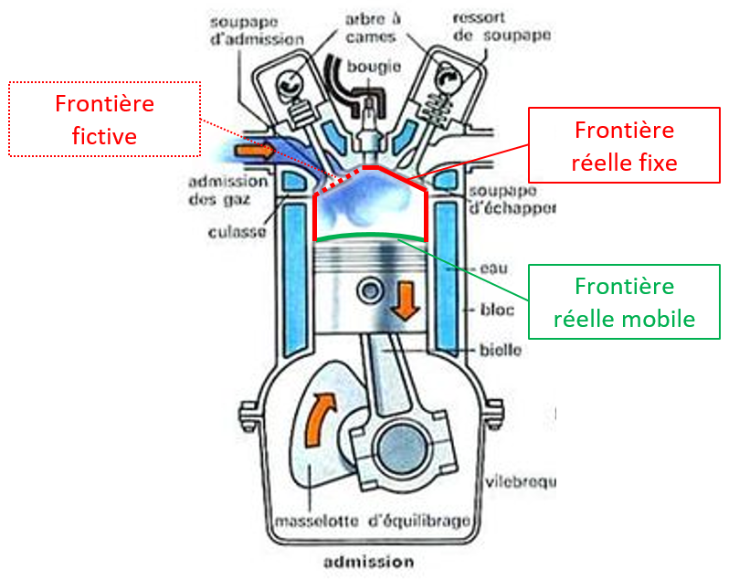
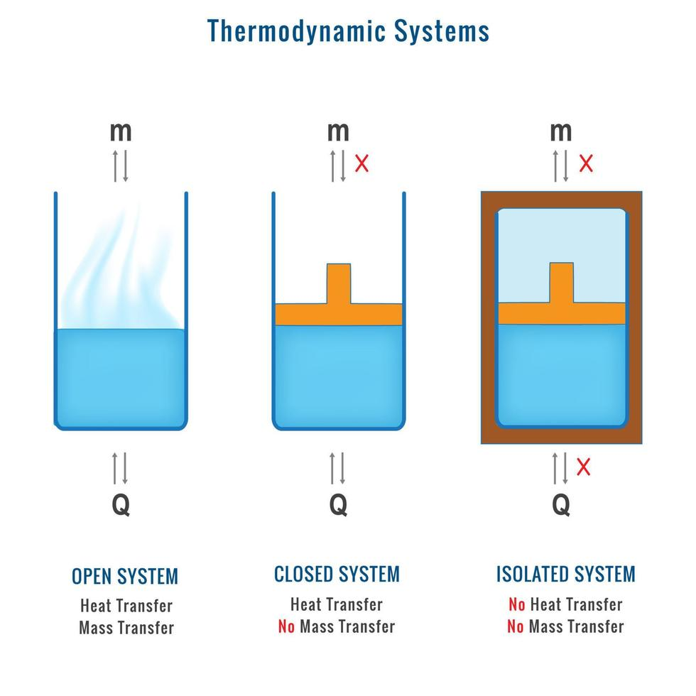
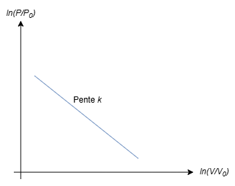
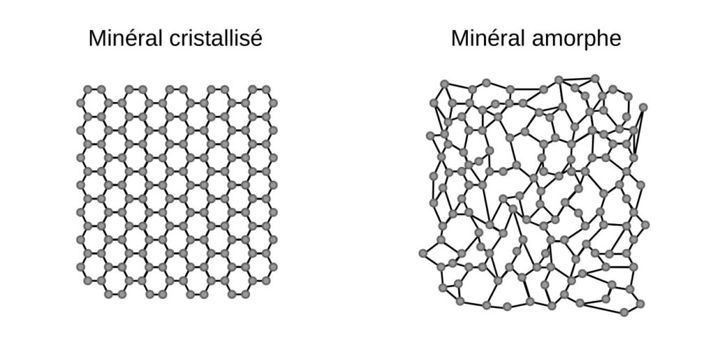
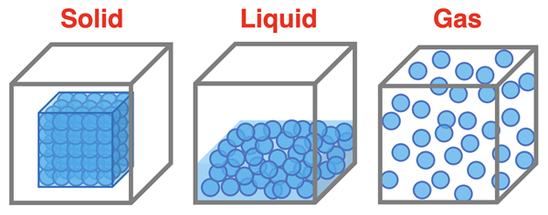

# Introduction à la thermodynamique
*SY0126 -- transcription approximative*

## À quoi correspond la thermodynamique ?

La thermodynamique est l'une des disciplines fondamentales de la physique. On va s'intéresser à l'évolution d'un système en fonction de ses échanges d'énergie avec l'extérieur. Nous allons introduire une nouvelle notion énergétique non-mécanique : la chaleur.

ThermoDynamique
ChaleurMouvement

Nous allons donc devoir effectuer des bilans énergétiques. Nous devrons alors introduire de nouveaux paramètres (variables d'état) pour caractériser l'état d'un système thermodynamique, comme la température, la pression, le volume, etc. Notre étude sera principalement orienté vers les fluides (gaz et liquides).

**On cherchera alors à déterminer l'énergie interne d'un système en s'appuyant sur des grandeurs/fonctions d'état.**

En mécanique, on sait que $\Delta E_m = W_{n,c}$. La thermodynamique nous amène à compléter cette relation en introduisant la chaleur $Q$ échangée entre le système et l'extérieur. On introduira une **notion d'énergie plus gobale : l'énergie interne $U$.**

*L'étude microscopique des systèmes thermodynamiques fait appel à la mécanique/thermodynamique statistique, qui n'est pas abordée dans ce cours. Nous ne disposons pas des outils mathématiques nécessaires pour cette étude.*

Ce qui sera abordé dans ce cours sera limité à la thermodynamique phénoménologique, c'est-à-dire l'étude des systèmes thermodynamiques à l'échelle macroscopique. Nous allons voir que ces observations sont compatibles avec la thermodynamique statistique.

Dans ce cours, nous allons **postuler** (c'est-à-dire accepter sans démonstration (lois empiriques)) les principes de la thermodynamique, essentiellement deux principes :

- **Premier principe de la thermodynamique** : Principe de conservation de l'énergie (énergie interne, travail, chaleur), qui nous permet de définir le <u>bilan énergétique</u> d'un système.
- **Deuxième principe de la thermodynamique** : <u>Principe d'évolution</u> des systèmes, qui nous permet de définir la notion d'entropie et de comprendre dans quel sens les transformations spontanées ont lieu.

Les variables d'état que nous allons aborder sont :
- La température $T$ (K)
- La pression $P$ (Pa)
- Le volume $V$ (m³)
- La quantité de matière $n$ (mol)

(on peut aussi introduire d'autres grandeurs comme la masse volumique, la densité, etc.)

Ces grandeurs/variables d'état sont reliées entre elles par des **équations d'état**.

## Système thermodynamique

Un système thermodynamique est un corps ou ensemble de corps (qu'il soit solide ou fluide) formant un ensemble réel ou virtuel délimité par des frontières (réelles ou imaginaires) qui le séparent de son environnement (l'univers, l'environnement extérieur), plus précisément de la partie de l'univers immédiatement voisine du système, appelée le milieu extérieur.

**Notion d'Univers :** L'univers matériel est un système isolé n'a pas d'extérieur matériel. L'énergie d'un tel système est constante.

On distingue trois types de systèmes thermodynamiques en fonction des échanges possibles avec l'extérieur :

| Système ouvert | Système fermé | Système isolé |
|----------------|---------------|---------------|
| Échange de matière et d'énergie avec l'extérieur | Échange d'énergie mais pas de matière avec l'extérieur | Pas d'échange d'énergie ni de matière avec l'extérieur |

**Un système en équilibre thermodynamique n'évolue plus, c'est-à-dire que les variables d'état le caractérisant restent constantes dans le temps.**

(analogie avec la mécanique : un système en équilibre mécanique n'évolue plus, c'est-à-dire que les variables d'état le caractérisant restent constantes dans le temps : position, vitesse, etc.)

Pour pouvoir utiliser les deux principes que nous avons défini, nous aurons besoin de définir des fonctions d'état pour chacun d'entre eux.

On dit qu'une grandeur $X$ est une fonction d'état si sa variation ne dépend que d'un état initial $i$ et un état final $f$. (Analogie mécanique avec les forces conservatives...). Elle est indépendante de la nature de la transformation.

$$\Delta X_{réel} = \Delta X_{hyp}$$

Bien sûr, $Q_{réel}$ et $W_{réel}$ à un certain instant ne coïncident pas avec les quantités au même instant dans le chemin hypothétique, mais les <u>quantités échangées</u> restent les même.

## Principe Zéro

**La relation d'équilibre thermique est transitive**. On peut introduire une nouvelle grandeur scalaire : la température $T$ en $K$ Kelvin <u>(pas degrés !!!!)</u>.

*Bonus : Le troisième principe de la thermodynamique stipule que $T=0K$ si tous les degrés de liberté sont gelés au niveau microscopique.*

Échelle de température

- Échelle de Celsius : $T(°C) = T(K) - 273.15$. Définie sur les points fixes de l'eau à $1$ atm (0°C et 100°C). Le fait que la relation soit aussi simple est purement aléatoire (évolution parfaitement proportionnelle au Kelvin). Ce n'est pas le cas des autres échelles (comme l'échelle Fahrenheit).

## Transformations possibles

**Une transformation physique est le passage d'un état <u>d'équilibre</u> thermodynamique à un autre.** Les variables d'état sont modifiées et, en général, indéfinies pendant la durée de la transformation.

| Transformation quasistatique | Transformation non-quasistatique/rapide |
|-|-|
|Les variables d'état sont définies dans tous les états d'équilibre intermédiaires. | Les variables d'état ne sont pas définies pendant la transformation (uniquement l'état initial et final). Il s'agit d'une transformation non-homogène. |

| Transformation réversible | Transformation irréversible |
|-|-|
| Il s'agit d'une transformation hypothétique (non-réelle). Elle suppose qu'on peut repasser exactement par tous les états d'équilibres successifs dans le sens inverse. | Tout le contraire d'une transformation réversible (frottements rendant cette dernière impossible...) |

On va considérer les transformations quasistatiques comme étant réversibles **(même si quasistatique ne veut pas forcément dire réversible)**. On va surtout s'intéresser aux transformations réversibles.

| Transformation isotherme | Transformation adiabatique |
|-|-|
| La température reste constante pendant toute la transformation ($\Delta T = 0$). | La température est constante mais le système évolue de manière non-quasistatique. |

<!-- euhh ueh eh à revoir -->

| Transformation monobare | Transformation isobare |
|-|-|
| Pression constante, système non-quasistatique (pression indéfinie) | Pression constante $\Delta P = 0$ |

| Transformation monovoluque | Transformation isochore |
|-|-|
| Volume constant, système non-quasistatique (volume indéfini) | Volume constant $\Delta V = 0$ |

**Transformation adiabatique :** Le système n'échange pas de chaleur avec le milieu extérieur. Il est séparé du milieu extérieur par une "paroi" isolante (thermiquement parlant). *Il n'existe évidemment pas d'isolant parfait...*

**Transformation cyclique :** Le système possède des états initiaux et finaux identiques. La variation des fonctions d'état (entre l'état initial et l'état finale) est nulle.

**Transformation polytropique :** Une transformation au cours de laquelle la pression $P$ et le volume $V$ sont reliés par la relation $PV^k = cte$, où $k$ est un exposant caractéristique de la transformation (paramètre de la transformation polytropique).

$$lnP+klnV = cte$$

| Pression | $P_0$ | $P_1$ | $P_2$ | ... | $P_n$ |
|-|-|-|-|-|-|
| **Volume** | $V_0$ | $V_1$ | $V_2$ | ... | $V_n$ |

$$cte = (P_0V_0)^k$$

Si on considère que le système étudié est un gaz parfait, alors $k\approx 1$. On retrouve alors la **transformation isotherme**.

Dans le cas où $k\approx 0$, on retrouve la **transformation isobare**.

Dans le cas où $k\gg 1$, on retrouve la **transformation isochore**.

## État d'un corps pur

L'état du corps est caractérisé par les variables $P$ et $T$ du corps. On peut donc tracer un diagramme $P-V$ pour représenter les transformations subies par le système.

### État solide

Les particules constitutives d'un corps se trouvent à une place déterminée dans un espace à trois dimensions et effectuent des mouvements de vibration autour de cette position d'équilibre.

**Types de solides :**

- Solides cristallins (arrangements ordonnés/périodique)
- Solides amorphes (arrangements désordonnés/aléatoire)

Les solides sont **incompressibles** (variation de volume négligeable sous l'effet de la pression), mais leur volume peut être modifié (sous l'effet, par exemple, de la température).

On peut leur attribuer une **masse volumique** $\rho = \frac{m}{V}$, qui ne dépend pas de $P$ (pression) mais dépend de $T$ (température).

### État fluide

#### État liquide

Les particules constitutives d'un liquide sont en contact les unes avec les autres, mais elles ne sont pas figées dans une position d'équilibre. Elles peuvent se déplacer les unes par rapport aux autres. On dit qu'elles sont **libres**. C'est l'une des caractéristiques en commun avec les gaz. Les liquides sont, en revanche, **incompressibles** (comme les solides).

#### État gazeux

Les particules constitutives d'un gaz sont très éloignées les unes des autres et se déplacent librement dans tout le volume disponible. Les gaz sont **compressibles** (leur volume peut varier de manière significative sous l'effet de la pression). On peut leur attribuer une masse volumique $\rho = \frac{m}{V}$, qui dépend de $P$ (pression) et de $T$ (température).

**Tableau récapitulatif**

| État | Solide | Liquide | Gazeux |
|-|-|-|-|
| Structure | Ordonnée (cristallin) ou désordonnée (amorphe) | Désordonnée | Très désordonnée |
| Compressibilité | Non | Non | Oui |
| Liberté de mouvement des particules | Vibrations autour d'une position fixe | Déplacement relatif entre particules | Mouvement libre dans tout le volume |
| Masse volumique $\rho$ | Dépend de $T$ | Dépend de $T$ | Dépend de $P$ et $T$ (par exemple, $PV=nRT$) |

### Pression dans un fluide

La pression exercée par un fluide sur la surface du volume qui le contient est définie comme suit :

$$d^2\vec{F} = -P_{int}(M) d^2\vec{S}(M)$$

Il s'agit de la force exercée par le fluide sur une surface élémentaire, de manière parfaitement perpendiculaire à cette dernière.

*Note : On utilise la dérivée seconde $d^2$ pour indiquer une surface élémentaire. Analogie: Triple-intégrale pour le volume $\iiint$ parce qu'on intègre selon $dx,dy,dz$*

$$\vec{F}=\oiint_{S} d^2\vec{F} = \oiint_{S} P_{int}(M) d^2\vec{S}(M)$$

*On utilise la double intégrale de surface (intégrale de contour) parce qu'on intègre sur une surface fermée. Attention : $P$ peut ne pas être une constante.*

<!-- à revoir -->

Si la force exercée par le fluide présente un angle $\theta$ avec la normale à la surface élémentaire, on peut décomposer cette force en une composante normale et une composante tangentielle pour ensuite ne retenir que la composante normale avant le calcul de la pression.

L'unité de la pression est le Pascal (Pa = N/m² = kg/m.s²). $1~\text{atm} = 1.013 \times 10^5 ~\text{Pa}$.

## Loi fondamentale de l'hydrostatique

Définition d'un gradient

Le gradient est un opérateur différentiel qui s'applique à une fonction scalaire et qui nous permet d'obtenir la direction de euh

$$\overrightarrow{grad}=\left|
    \begin{array}{ll}
        \frac{\partial}{\partial x} \\
        \frac{\partial}{\partial y} \\
        \frac{\partial}{\partial z}
    \end{array}
    \right.$$

$$\overrightarrow{grad}=\rho \vec{g}$$

**Remarque :** si une autre force <!-- laquelle ?? --> intervient avec la densité volumique $\vec{F}_v$, alors $\overrightarrow{grad}P=\vec{F}_v+\rho\vec{g}$.

<!-- calcul à reprendre -->

**Application : Nous allons montrer que la surface de contact de l'eau avec l'air dans la figure sera à la même hauteur (même pression atmosphérique)**

*non recopié*

<!-- espace pour recopier à l'écrit -->
<!-- avec divs html -->

Démonstration à refaire ;)

<i>(j'ai pas recopié)</i>

**Dans un fluide incompressible, $\rho$ est indépendant de la pression $P$.**

Donc $\rho$ est uniforme dans tout le fluide. Alors $\overrightarrow{grad} P = \rho \vec{g}$

Donc $dP = -\rho g dz$

Donc $P(z) = -\rho g z + cte$

Pour $z=0$, $P(0) = P_0 = cte$

Donc $P(z) = P_0 - \rho g z$

---

### Exemple (1) : Bassin rempli d'eau

$$\begin{cases} \rho = 1000~kg/m^3 \\ g = 10m\cdot s^{-2} \end{cases}$$

$$P_A = P_0 - \rho g z_A$$
$$P_B = P_0 - \rho g z_B$$

$$P_B - P_A = \rho g \underbrace{(z_A - z_B)}_{\text{hauteur}}$$

Essayons de mesurer la différence de pression entre la surface et un point situé à $h=10$ m de profondeur.

On a $P_0 = 1.013 \times 10^5 ~Pa$

Donc $P_B - P_A = 1000 \times 10 \times 10 = 10^5 ~Pa$

Donc $P_B = P(-h) = 2.013 \times 10^5 ~Pa \approx 2 ~atm$

Fosses marines

Les fosses marines les plus profondes atteignent environ $11~km$ de profondeur. La pression y est donc d'environ $1100~atm$.

### Exemple 2 : Liquides non-miscibles

On a $\rho_\text{eau} \ne \rho_\text{huile}$.

$$P_A = P_0 - \rho_\text{huile} g z_A = P_0$$
(on prend A comme étant la surface de l'huile)
$$P_S = P_0 - \rho_\text{huile} g z_S$$

On prend un point arbitraire dans l'eau.

$$P_B = P_0 - \rho_\text{huile} g z_S - \rho_\text{eau} g (z_B - z_S)$$

On a donc $P_B - P_S = -\rho_\text{eau} g (z_B - z_S)$.

## Gaz parfaits

L'équation d'état des gaz parfaits est donnée par :

$$PV = nRT$$

En remplaçant $n$ par $\frac{m}{M}$ (masse sur masse molaire), on obtient :

$$PV = \frac{m}{M} RT$$

En remplaçant $m$ par $\rho V$ (masse volumique fois volume), on obtient :

$$P = \frac{\rho}{M} RT$$

En admettant que l'évolution du système est isotherme, on peut écrire que :

$$\rho(P) = \frac{PM}{RT}$$

### Pression atmosphérique en fonction de l'altitude

On sait que $\overrightarrow{grad} P = \rho \vec{g}$. En remplaçant *scalairement* $\rho$ par son expression en fonction de $P$, on obtient :

$$\frac{dP(z)}{dz} = -\frac{M}{RT} g\cdot P(z)$$

On a donc la relation différentielle suivante :

$$\frac{dP(z)}{dz} + \frac{Mg}{RT} P(z) = 0$$

On pose $H = \frac{RT}{Mg}$ (hauteur caractéristique).

Après résolution de l'équation différentielle, on obtient :

$P(z)=P_0 e^{-\frac{z}{H}}$

**Application numérique pour trouver $H$ :**

Pour l'air, on a $M \approx 29~g/mol = 29 \times 10^{-3}~kg/mol$. On a $R=8.31~J/(mol\cdot K)$. On prend $T=288~K$ (température moyenne à la surface de la Terre). On a $g=9.81~m/s^2$.

*(oui, je sais que dans le cours sur tableau, on a utilisé $g=10m/s^2$ et $T=298~K$)*

On trouve $H \approx 8.4~km$.

À une altitude de $z=H$, la pression est donc divisée par $e \approx 2.718$.

**Température à travers l'atmosphère**

La température diminue avec l'altitude dans la troposphère (jusqu'à environ $11~km$ d'altitude). Le gradient thermique moyen est d'environ $6.5~K/km$.

$$T(z) = T_0 - \alpha z$$
avec $\alpha \approx 6.5 \times 10^{-3}~K/m$.

Il s'agit uniquement d'une approximation valable pour la troposphère, similaire à un développement limité de petit ordre.

En remplaçant $T$ dans l'équation différentielle précédente, on obtient :

$$\frac{dP(z)}{dz} + \frac{Mg}{R(T_0 - \alpha z)} P(z) = 0$$

Pour résoudre cette équation différentielle, on utilise la méthode de séparation des variables :

$$\frac{dP(z)}{P(z)} = -\frac{Mg}{R(T_0 - \alpha z)} dz$$

Après résolution de cette nouvelle équation différentielle, on obtient :

$$\ln(P(z))=\frac1H \frac{T_0}{\alpha} \ln\left(1 - \frac{\alpha z}{T_0}\right) + cte$$

La constante correspond évidemment à $\ln(P_0)$.

$$P(z) = P_0 \left(1 - \frac{\alpha z}{T_0}\right)^{\frac{T_0}{H\alpha}}$$

La caractéristique $\frac{T_0}{\alpha}$ est égale à environ $46\times10^3~m$.

**Dans des altitudes relativement faibles, en dessous par exemple de $10~km$, on peut négliger $\frac{\alpha z}{T_0}$ devant $1$, et faire un développement limité au premier ordre pour retrouver l'expression précédente de la pression en fonction de l'altitude.**

### Densité de l'air en fonction de l'altitude

$$\begin{cases}m=\text{ masse d'une particule du gaz étudié} \\ M=\text{ masse molaire du gaz étudié} \\ N_A=\text{ nombre d'Avogadro} \end{cases}$$

On a donc $M = m N_A$.

En remplaçant dans l'équation d'état des gaz parfaits, on obtient :

$$\rho = \frac{PM}{RT} = \frac{PmN_A}{RT}$$

Nouvelle grandeur

Nous allons définir une nouvelle grandeur $n$ qui représente le nombre de particules par unité de volume, telle que $n=\frac NV$.

**C'est cette grandeur que nous allons utiliser pour étudier la densité de l'air.**

On sait que $\rho = nm$, où $n$ est le nombre de particules par unité de volume.

Donc $n=\frac{\rho}{m} = \frac{PN_A}{RT}$

En admettant que l'évolution se fait de manière isotherme, on peut écrire que :

$$n(z)=\frac{P(z)N_A}{RT}$$

En insérant l'expression de $P(z)$, on obtient :

$$n(z)=n_0 e^{-\frac{z}{H}}$$

ou encore $$n(z)=n_0 e^{-\frac{N_A mg z}{RT}}$$

On pose $k_B = \frac{R}{N_A}$ (constante de Boltzmann).

On trouve alors :

$$\boxed{n(z)=n_0 e^{-\frac{mgz}{k_B T}}}$$

Cette expression nous permet donc de déterminer la distribution de la densité de particules dans un gaz parfait en fonction de l'altitude, en supposant une évolution isotherme.

Probabilité de présence

On peut interpréter cette expression en termes de probabilité de présence d'une particule à une altitude $z$ donnée.

La probabilité $P(z)$ de trouver une particule à une altitude $z$ est proportionnelle à la densité de particules à cette altitude :

$$\frac{dN}{N} = \frac{n(z) dV}{N}$$
où $N$ est le nombre total de particules dans le volume considéré.

<!-- facteur de boltzmann -->

Facteur de Boltzmann

Le terme exponentiel $e^{-\frac{mgz}{k_B T}}$ est appelé le facteur de Boltzmann. Il décrit comment la probabilité de présence d'une particule diminue avec l'altitude en raison de l'effet combiné de la gravité et de la température.

Il apparaît à chaque fois qu'on étudie un système dont les particules sont indépendantes, en équilibre avec un thermostat à température $T$. On étudie alors la probabilité de présence d'une particule dans un état d'énergie $\varepsilon$.

La probabilité de trouver une particule dans un état d'énergie $\varepsilon$ est proportionnelle à $e^{-\frac{\varepsilon}{k_B T}}$.

$$P(\varepsilon) = C\cdot e^{-\frac{\varepsilon}{k_B T}}$$

Étudions par exemple la probabilité de trouver une particule à deux états énergétiques $\varepsilon_1$ et $\varepsilon_2$ tels que $\varepsilon_2 > \varepsilon_1$.

On a $\frac{N_2}{N_1} = \frac{P(\varepsilon_2)}{P(\varepsilon_1)} = e^{-\frac{(\varepsilon_2 - \varepsilon_1)}{k_B T}}$.

On remarque que ce ratio augmente avec la température $T$ et diminue avec la différence d'énergie $\varepsilon_2 - \varepsilon_1$.

Cela explique par exemple pourquoi certaines planètes perdent leur atmosphère ; Mercure a une température élevée et une faible gravité, ce qui permet aux particules de haute énergie d'échapper à l'attraction gravitationnelle de la planète. Titan, une lune de Saturne, a une température bien plus basse mais une gravité plus faible que la Terre, ce qui lui permet de retenir une atmosphère très dense.

### Théorème d'Archimède/Poussée d'Archimède

Un corps plongé dans un fluide subit une force de poussée verticale dirigée vers le haut, égale au poids du volume de fluide déplacé.

Il s'agit d'un effet du fluide sur la surface (il ne dépend pas de la nature du corps immergé). On peut même l'appliquer à des corps creux ou des surfaces imaginaires.

Cela explique pourquoi les bateaux flottent sur l'eau ou pourquoi les ballons montent dans l'air.

**Démonstration du théorème :**

$$d\vec{F_p} = P\cdot d\vec{S}$$

$$\vec{F_p} = \oiint_{S} P\cdot d\vec{S}$$

On en déduit que :

$$\vec{F_p} = -\rho_{\text{fluide}} \cdot V_{\text{fluide déplacé}} \cdot \vec{g}$$

### Expérience de Torricelli

L'objectif de cet expérience était de réaliser une mesure absolue de la pression atmosphérique.

Le mercure a donc été utilisé pour cette expérience en raison de sa haute densité (environ $13.6$ fois celle de l'eau). Cela permettait d'obtenir une hauteur de colonne de mercure plus raisonnable pour mesurer la pression atmosphérique.

**Note :** Le mercure a une pression de passage à l'état gazeux très faible. Dans le schéma, Torricelli a considéré que le reste de la colonne en haut est vide, ce qui est une approximation acceptable.

Après avoir rempli le tube de mercure et l'avoir retourné dans le bassin, une colonne de mercure de hauteur $h$ reste dans le tube. La pression au sommet de la colonne est négligeable (approximée à zéro).

La pression exercée par la colonne de mercure à sa base est donc égale à la pression atmosphérique. On a donc effectué une mesure **absolue** de la pression atmosphérique.

On peut donc utiliser ensuite des manomètres différentiels pour mesurer des pressions relatives par rapport à cette pression absolue.

<!-- tableau récapitulatif des capteurs de pression -->

| Type de capteur | Description |
|-|-|
| Manomètre à colonne de liquide | Utilise une colonne de liquide (comme le mercure ou l'eau) pour mesurer la pression relative. La différence de hauteur de la colonne indique la différence de pression. |
| Manomètre à membrane | Utilise une membrane flexible qui se déforme sous l'effet de la pression. La déformation est convertie en une mesure de pression. |
| Capteur piézoélectrique | Utilise des matériaux piézoélectriques qui génèrent une charge électrique lorsqu'ils sont soumis à une pression. |

**Exemple d'utilisation du capteur piézoélectrique :**

$$U = 2k F$$
où $U$ est la tension générée, $k$ est une constante dépendant du matériau piézoélectrique, et $F$ est la pression exercée sur le capteur.

En appliquant des forces différentes sur une face et l'autre face du capteur, on peut mesurer la différence de pression entre les deux faces.

$$U=2k(P+P_0)$$

où $P_0$ est la pression de référence (par exemple, la pression atmosphérique).